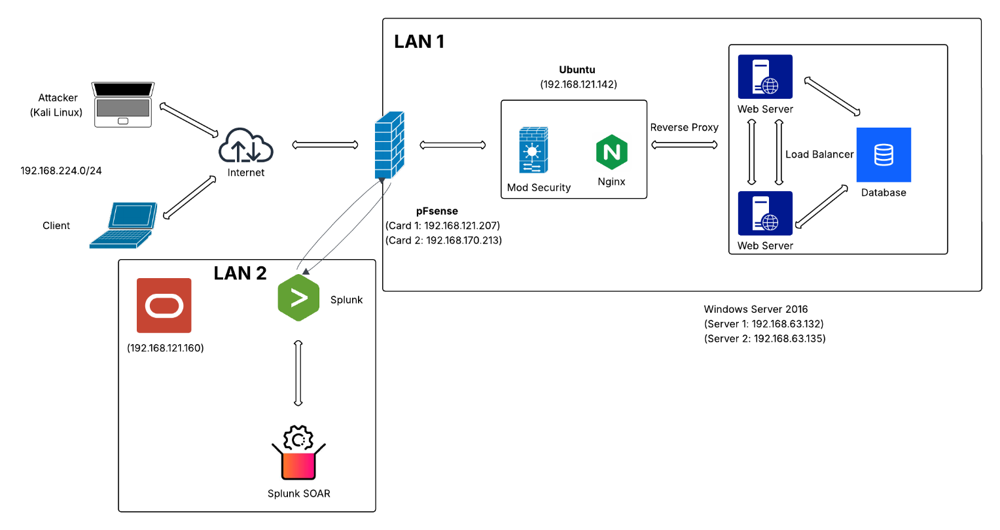

# Hệ thống Reverse Proxy đa lớp trên NGINX chống DDoS và khai thác dữ liệu

Đề tài nghiên cứu khoa học sinh viên — Khoa Công nghệ thông tin, Trường Đại học Gia Định.

Repo này chứa toàn bộ cấu hình, hướng dẫn triển khai và kịch bản kiểm thử của một mô
hình phòng thủ chiều sâu (*Defense in Depth*) bốn tầng, xây dựng quanh NGINX Reverse
Proxy và khép kín bằng chu trình phản ứng tự động Splunk SIEM/SOAR.

Mục tiêu thực tiễn: dựng được một **SOC thu nhỏ** hoàn toàn bằng phần mềm mã nguồn mở,
thay thế các dịch vụ Cloud WAF trả phí cho doanh nghiệp vừa và nhỏ.

---

## Kiến trúc

```
                        Internet
                            │
              ┌─────────────▼─────────────┐
   TẦNG 1     │   pfSense  +  Snort/Suricata │   Lọc gói tin, IDS/IPS
   Biên mạng  │   WAN · LAN · DMZ · MGMT     │   Chặn SYN/UDP flood
              └─────────────┬─────────────┘
                            │
              ┌─────────────▼─────────────┐
   TẦNG 2     │   NGINX Reverse Proxy       │   Ubuntu Server 22.04
   Ứng dụng   │   ModSecurity v3 + OWASP CRS│   Chặn SQLi, XSS, RCE
              │   Rate Limiting · Fail2Ban  │   Chặn HTTP Flood, Slowloris
              │   Load Balancer (ip_hash)   │   TLS termination
              └─────────────┬─────────────┘
                            │
              ┌─────────────▼─────────────┐
   TẦNG 3     │   Backend ×2 (Win Server)   │   XAMPP + DVWA
   Lõi        │   Ẩn hoàn toàn khỏi Internet│   Chỉ nhận traffic đã lọc
              └─────────────┬─────────────┘
                            │ log
              ┌─────────────▼─────────────┐
   TẦNG 4     │   Splunk SIEM  +  SOAR      │   Oracle Linux 9
   Giám sát   │   Tương quan sự kiện · SPL  │   Playbook chặn IP tự động
              └───────────────────────────┘
                     └──── vòng phản hồi ────┐
                                             ▼
                          Ghi deny rule xuống NGINX / pfSense
```

Điểm khác biệt so với một mô hình WAF thông thường nằm ở **vòng phản hồi**: SIEM không
chỉ ghi nhận mà còn kích hoạt SOAR gửi lệnh chặn ngược trở lại tầng biên qua SSH và
REST API, biến hệ thống từ tấm khiên tĩnh thành một thực thể có phản xạ.

---

## Sơ đồ mạng thực nghiệm

| Vùng | Thành phần | Hệ điều hành | Địa chỉ IP |
|---|---|---|---|
| Biên | pfSense 2.7.2 | FreeBSD | WAN: DHCP · LAN: `192.168.170.213` · DMZ: `192.168.224.222` |
| DMZ | NGINX Reverse Proxy | Ubuntu Server 22.04 | `192.168.121.142` |
| LAN | Backend 1 (DVWA) | Windows Server 2016 | `192.168.63.132` |
| LAN | Backend 2 (DVWA) | Windows Server 2016 | `192.168.63.135` |
| MGMT | Splunk SIEM + SOAR | Oracle Linux 9 | `192.168.121.160` |
| Ngoài | Máy tấn công | Kali Linux | `192.168.224.128` |

Toàn bộ chạy trên VMware để cô lập và kiểm soát biến số thực nghiệm.



---

## Kết quả kiểm thử

Tám kịch bản tấn công được thực hiện từ Kali Linux nhắm vào DVWA, có và không có lớp
Reverse Proxy để làm đối chứng.

| # | Kịch bản | Payload | Kết quả |
|---|---|---|---|
| 1 | SQL Injection | `' or 1=1#` | Chặn — `403 Forbidden` |
| 2 | XSS DOM | `<svg onload=alert(1)>` | Chặn — `403 Forbidden` |
| 3 | XSS Reflected | `<script>alert(...)</script>` | Chặn — `403 Forbidden` |
| 4 | XSS Stored | `` | Chặn — `403 Forbidden` |
| 5 | CSP Bypass | `<script>alert(1)</script>` | Chặn — `403 Forbidden` |
| 6 | Command Injection | `127.0.0.1 \| ls` | Chặn — `403 Forbidden` |
| 7 | JavaScript Attack | `md5()`, `rot13()` injection | Chặn — `403 Forbidden` |
| 8 | DDoS (Slowloris) | 150 sockets đồng thời | Dịch vụ vẫn hoạt động |

Kịch bản 8 là kết quả đáng chú ý nhất vì có nhóm đối chứng rõ ràng:

- **Tấn công trực tiếp vào backend** → `The connection has timed out`, dịch vụ sập hoàn toàn.
- **Tấn công qua NGINX Reverse Proxy** → người dùng hợp lệ vẫn truy cập bình thường
  trong khi Kali vẫn đang duy trì cường độ tấn công.

Log trên Splunk xác nhận cơ chế **Anomaly Scoring** của OWASP CRS hoạt động đúng: payload
SQLi đạt `Total Score: 15` trên ngưỡng chặn là `5`, tức là request vi phạm nhiều luật cộng
dồn chứ không phải khớp đơn lẻ một luật.

Chi tiết từng kịch bản kèm ảnh chụp màn hình: [docs/03-mo-hinh-thuc-nghiem.md](docs/03-mo-hinh-thuc-nghiem.md#33-kiểm-thử-hệ-thống)

---

## Cấu trúc repo

```
├── configs/                    Cấu hình dùng được ngay
│   ├── nginx/                  nginx.conf, reverse proxy, rate limiting
│   ├── modsecurity/            engine config, CRS loader, ngoại lệ
│   ├── fail2ban/               jail.local + 3 filter tự viết
│   ├── splunk/                 inputs/outputs forwarder, truy vấn SPL
│   └── snort/                  local.rules cho pfSense
├── docs/
│   ├── 01-tong-quan.md         Bối cảnh, mục tiêu, phạm vi
│   ├── 02-co-so-ly-thuyet.md   Defense in Depth, phân tích vector tấn công
│   ├── 03-mo-hinh-thuc-nghiem.md  Triển khai + kết quả kiểm thử
│   ├── 04-ket-luan.md          Kết luận, hạn chế, hướng phát triển
│   ├── tai-lieu-tham-khao.md
│   ├── setup/                  Hướng dẫn cài đặt từng bước
│   └── images/                 45 ảnh chụp thực nghiệm
└── tests/                      Kịch bản tấn công tái lập được
```

---

## Bắt đầu

Làm theo thứ tự — mỗi bước phụ thuộc bước trước.

| Bước | Tài liệu | Nội dung |
|---|---|---|
| 1 | [Chuẩn bị lab](docs/setup/00-chuan-bi.md) | Yêu cầu phần cứng, sơ đồ máy ảo |
| 2 | [pfSense](docs/setup/01-pfsense.md) | Phân vùng WAN/LAN/DMZ, Snort, Suricata |
| 3 | [NGINX Reverse Proxy](docs/setup/02-nginx-reverse-proxy.md) | Cài đặt, reverse proxy, load balancer |
| 4 | [ModSecurity WAF](docs/setup/03-modsecurity-waf.md) | Biên dịch từ source, nạp OWASP CRS |
| 5 | [Fail2Ban](docs/setup/04-fail2ban.md) | Jail và filter cho Nginx |
| 6 | [Backend DVWA](docs/setup/05-backend-dvwa.md) | XAMPP + DVWA trên Windows Server |
| 7 | [Splunk SIEM/SOAR](docs/setup/06-splunk-siem-soar.md) | Forwarder, indexer, playbook tự động |
| 8 | [Kiểm thử](tests/README.md) | Tái lập 8 kịch bản tấn công |

---

## Yêu cầu

- VMware Workstation / ESXi, tối thiểu **16 GB RAM** và **200 GB** ổ đĩa
  (riêng Splunk SOAR đã cần 8 GB RAM)
- pfSense 2.7.2 · Ubuntu Server 22.04 · Windows Server 2016 · Oracle Linux 9 · Kali Linux
- NGINX 1.18.0 (biên dịch từ source) · ModSecurity 3.0.14 · OWASP CRS 4.x
- Splunk Enterprise + Splunk SOAR (bản dùng thử miễn phí)

---

## Cảnh báo an toàn

DVWA là ứng dụng **cố ý chứa lỗ hổng**. Chỉ triển khai trong mạng ảo hóa cô lập, tuyệt đối
không expose ra Internet.

Mọi kỹ thuật tấn công trong repo này chỉ được thực hiện trên hạ tầng do chính nhóm nghiên
cứu sở hữu. Sử dụng chúng với hệ thống không thuộc quyền sở hữu của bạn là hành vi vi phạm
pháp luật.

---

## Nhóm nghiên cứu

**Giảng viên hướng dẫn:** ThS. Dương Trọng Khang

| Thành viên | MSSV | Vai trò |
|---|---|---|
| Lê Thanh Hải | 23150113 | Trưởng nhóm — kiến trúc hệ thống, triển khai hạ tầng, SOC |
| Nguyễn Minh Toàn | 23150145 | Pentest — nghiên cứu vector tấn công, kiểm thử chịu tải |
| Nguyễn Thị Mỹ Phương | 23150263 | GRC — phân tích log, logic cảnh báo, tuân thủ ISO/NIST |

Thời gian thực hiện: 12/2024 – 04/2026.

---

## Giấy phép

[MIT](LICENSE) cho phần cấu hình và mã nguồn.

Nội dung báo cáo trong `docs/` thuộc bản quyền của nhóm nghiên cứu, phát hành theo
[CC BY-NC 4.0](https://creativecommons.org/licenses/by-nc/4.0/deed.vi) — được phép chia sẻ
và chỉnh sửa cho mục đích phi thương mại, kèm ghi nguồn.
