# Chương 3 — Mô hình thực nghiệm

## 3.1. Giới thiệu

### 3.1.1. Mục tiêu

Mô hình được thiết lập để **kiểm chứng và định lượng** khả năng phòng thủ đa tầng trước
các biến thể tấn công DDoS và khai thác dữ liệu web. Cụ thể:

- Xác thực khả năng phòng thủ đa lớp qua sự kết hợp pfSense + NGINX/ModSecurity + Splunk
- Chủ động thực thi biện pháp ngăn chặn, không dừng ở phát hiện
- Phân tích định lượng thời gian duy trì dịch vụ (uptime) và mức suy giảm hiệu năng
- Xác định rõ vai trò và **giới hạn** bảo vệ của từng lớp

### 3.1.2. Lý do chọn kiến trúc nhiều lớp

Xuất phát từ yêu cầu bảo đảm cả ba yếu tố của **CIA Triad** thông qua việc phân phối chức
năng chuyên biệt cho từng tầng, thay vì phụ thuộc một chốt chặn duy nhất:

- pfSense lọc lưu lượng ở tầng mạng
- NGINX Reverse Proxy xử lý nguy cơ tầng ứng dụng
- Splunk SIEM/SOAR làm trung tâm chỉ huy phân tích và tự động hóa phản ứng

Kiến trúc phân tầng còn cho phép cập nhật hoặc thay thế một thành phần bảo mật mà không
làm gián đoạn toàn hệ thống.

### 3.1.3. Sơ đồ tổng thể


Hệ thống chia thành ba phân vùng mạng với vai trò chuyên biệt.

**Phân vùng ngoại vi.** Lưu lượng từ bên ngoài — gồm cả người dùng hợp lệ và máy tấn công
Kali Linux — đi qua Internet đến tường lửa pfSense. Tại đây pfSense thực hiện lọc gói tin,
định tuyến và phân phối lưu lượng giữa các vùng mạng.

**Phân vùng dịch vụ (LAN 1).** Trung tâm điều phối và bảo vệ ứng dụng web. Lưu lượng đến
máy chủ Ubuntu `192.168.121.142` đóng vai trò Reverse Proxy, nơi NGINX kết hợp ModSecurity
phân tích sâu các gói tin HTTP/HTTPS. Yêu cầu an toàn sau đó mới được Load Balancer điều
phối đến cụm backend Windows Server 2016 (`192.168.63.132` và `192.168.63.135`).

**Phân vùng giám sát (LAN 2).** Cô lập hoàn toàn để đảm bảo tính độc lập. Máy chủ Oracle
Linux `192.168.121.160` chạy Splunk SIEM thu thập log tập trung từ NGINX và pfSense, kèm
Splunk SOAR tự động hóa phản ứng sự cố.

---

## 3.2. Triển khai

### 3.2.1. Cấu hình pfSense

#### Phân bổ giao diện mạng


Mô hình thiết lập bốn giao diện riêng biệt, mỗi giao diện gắn với một địa chỉ MAC vật lý
duy nhất: **WAN (em0)**, **LAN (em1)**, **OPT1 (em2)**, **OPT2 (em3)**.

Việc phân tách này hiện thực hóa nguyên lý **Least Privilege**: WAN là cửa ngõ duy nhất
tiếp nhận lưu lượng Internet, LAN phục vụ máy chủ nội bộ, OPT1 thiết lập vùng DMZ cho
NGINX, OPT2 dành riêng cho hệ thống giám sát Splunk. Mỗi vùng áp dụng bộ quy tắc lọc gói
tin đặc thù, cô lập rủi ro và ngăn tấn công leo thang giữa các phân vùng.

#### Giao diện WAN


WAN thiết lập theo cơ chế cấp phát địa chỉ động (DHCP cho cả IPv4 và IPv6) để tương thích
tối ưu với hạ tầng mạng của VMware.

MTU và MSS giữ ở giá trị mặc định. Đây là quyết định có chủ đích nhằm tránh hiện tượng
**phân mảnh gói tin** — vốn thường bị kẻ tấn công lợi dụng để vượt qua bộ lọc an ninh:
nếu WAF chỉ thấy một mảnh của payload, nó không nhận ra mẫu tấn công hoàn chỉnh.

#### Giao diện LAN


LAN gán địa chỉ tĩnh `192.168.170.213/24`, đóng vai trò cổng mặc định cho NGINX, cụm
backend và Splunk. IP tĩnh là **yêu cầu bắt buộc**: quy tắc định tuyến, chính sách lọc gói
tin và luồng log đẩy về SIEM đều tham chiếu theo địa chỉ, nên một thay đổi IP sẽ làm đứt
gãy toàn bộ chuỗi.

Chi tiết đáng chú ý: **IPv4 Upstream Gateway đặt ở trạng thái `None`**. Điều này khẳng
định pfSense là điểm nút điều phối trung tâm — trong phân vùng LAN, chính pfSense quyết
định định tuyến ra ngoài qua giao diện WAN. Loại bỏ Gateway phía trên ngăn hiện tượng lặp
vòng định tuyến và đảm bảo mọi yêu cầu từ nội bộ đều phải qua bộ lọc của tường lửa.

#### Vùng DMZ (OPT1)


OPT1 cấu hình với địa chỉ tĩnh `192.168.224.222/24`, tách hoàn toàn khỏi dải LAN. Mục đích
là tạo **vùng đệm**: NGINX tiếp nhận yêu cầu từ Internet qua WAN nhưng **không** có quyền
truy cập trực tiếp vào tài nguyên LAN trừ khi được cho phép bởi quy tắc tường lửa nghiêm
ngặt.

Đây là điểm mấu chốt của mô hình: nếu NGINX bị chiếm quyền, kẻ tấn công vẫn bị kẹt trong
DMZ chứ không chạm được vào backend.

#### IDS/IPS


Cài đặt song song Snort và Suricata qua trình quản lý gói, tạo lớp lọc kép cho lưu lượng
mạng trước khi tiếp cận tầng ứng dụng.

→ Luật tự viết: [`configs/snort/local.rules`](../configs/snort/local.rules)

### 3.2.2. NGINX Reverse Proxy

#### Trạng thái dịch vụ


Kiểm tra qua `systemctl status nginx` xác nhận trạng thái `active`, với cấu trúc tiến trình
Master/Worker đặc trưng của NGINX.

#### Cấu hình lõi

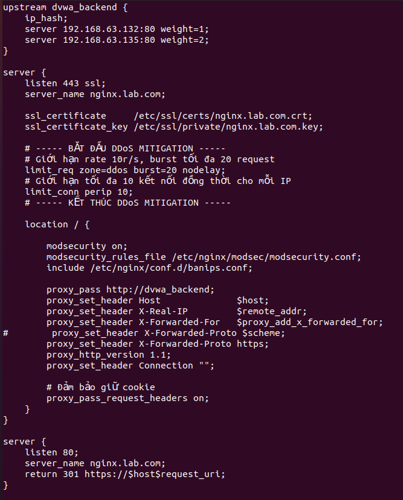

Đây là thành phần kỹ thuật trung tâm của đề tài. Bốn cơ chế được hợp nhất trong một file:

**Load Balancing.** Khối `upstream dvwa_backend` phân phối tải giữa `192.168.63.132` và
`192.168.63.135`. Phương pháp `ip_hash` đảm bảo tính nhất quán của phiên làm việc — cần
thiết vì DVWA lưu session PHP cục bộ. Khi một nút gặp sự cố, NGINX tự động điều hướng sang
nút còn lại.

**WAF.** `modsecurity on` kết hợp bộ luật tạo hàng rào phân tích sâu payload HTTP/HTTPS,
chặn SQLi và XSS trước khi chúng tiếp cận mã nguồn ứng dụng.

**Truy vết.** Các chỉ thị `proxy_set_header X-Real-IP` và `X-Forwarded-For` đảm bảo backend
và Splunk vẫn thấy được IP thật của người dùng cuối thay vì IP của proxy.

**Điểm nối với SOAR.** Việc `include` tệp `banips.conf` chính là điểm kết nối chiến lược:
đây là nơi Splunk SOAR tự động ghi các lệnh chặn IP độc hại theo thời gian thực.

Kết hợp với việc bắt buộc HTTPS trên cổng 443 và tự động chuyển hướng từ cổng 80, cấu hình
thiết lập môi trường truyền tải an toàn, giảm rủi ro tấn công trung gian.

→ [`configs/nginx/sites-available/reverse_proxy.conf`](../configs/nginx/sites-available/reverse_proxy.conf)

### 3.2.3. ModSecurity

#### Tổ chức thư mục

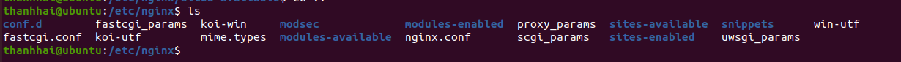

Cấu hình được mô-đun hóa: `modsec/` chứa quy tắc WAF, `conf.d/` chứa định nghĩa toàn cục,
`sites-available/` chứa máy chủ ảo. Cách tổ chức này cho phép mở rộng và tích hợp module
phòng thủ mới mà không ảnh hưởng tính ổn định của dịch vụ hiện hữu.

#### Xác nhận nạp luật


Nhật ký `error.log` xác nhận **ModSecurity-nginx v1.0.4** kết hợp **libmodsecurity3
v3.0.14**. Việc dùng `libmodsecurity3` là lựa chọn tối ưu vì nó được thiết kế riêng cho
kiến trúc kết nối trực tiếp của NGINX, giảm đáng kể độ trễ khi phân tích luồng dữ liệu.

Thông số then chốt: **`rules loaded: 0/812/0`**. Con số 812 quy tắc xác nhận bộ luật OWASP
CRS đã nạp thành công. Mọi yêu cầu HTTP/HTTPS qua Reverse Proxy đều được thẩm định nghiêm
ngặt trước khi chuyển tiếp vào nội bộ.

#### Các tham số cấu hình quan trọng

Bộ khung `modsecurity.conf` được can thiệp sâu ở bốn điểm so với bản khuyến nghị mặc định.

**Thẩm định dữ liệu chuyên sâu.** `SecRequestBodyAccess On` cho phép quét cả thân request
chứ không chỉ header. Quan trọng hơn, hệ thống cấu hình parser riêng cho **XML và JSON** —
nếu thiếu, kẻ tấn công có thể giấu payload SQLi bên trong chuỗi JSON phức tạp và đi lọt
hoàn toàn qua WAF.

**Chống cạn kiệt tài nguyên.**

| Tham số | Giá trị | Mục đích |
|---|---|---|
| `SecRequestBodyLimit` | 12,5 MB | Chặn request body quá khổ làm cạn RAM |
| `SecArgumentsLimit` | 1000 | Chặn HTTP Parameter Pollution |
| `SecPcreMatchLimit` | 1000 | Triệt tiêu **ReDoS** — ngăn payload khiến CPU treo do regex backtrack vô hạn |

**Kiểm soát lỗi parse.** Mọi sai sót khi parse gói tin Multipart hoặc lỗi không khớp ranh
giới đều dẫn tới `400 Bad Request` ngay lập tức. Lý do: gói tin dị hình là công cụ bypass
phổ biến, khai thác việc parser của WAF và của backend hiểu khác nhau về cùng một gói tin.

**Nhật ký cho SIEM.** `SecAuditEngine RelevantOnly` chỉ ghi các sự kiện thực sự quan trọng
(lỗi 4xx trừ 404, và 5xx), lưu dạng Serial tại `/var/log/modsec_audit.log`. Việc lọc bỏ
404 giảm **nhiễu** cho tầng giám sát — 404 chiếm phần lớn lưu lượng rác nhưng hầu như
không mang giá trị điều tra.

→ [`configs/modsecurity/modsecurity.conf`](../configs/modsecurity/modsecurity.conf)

### 3.2.4. Fail2Ban


Dịch vụ hoạt động với mức tiêu thụ tài nguyên rất thấp — khoảng **8,4 MB** bộ nhớ.

Fail2Ban quét các tệp nhật ký NGINX tìm mẫu vi phạm đã định nghĩa. Khi một IP vượt ngưỡng
số lần đăng nhập sai hoặc liên tục nhận mã 403/404, Fail2Ban tự động ra lệnh cho tường lửa
nội bộ cấm IP đó. Cơ chế này tạo lớp phản xạ nhanh ngay tại máy chủ Reverse Proxy.

Mọi hành động ban/unban đều được đẩy về Splunk SIEM để phân tích tương quan toàn cục, làm
đầu vào cho các Playbook nâng cao của SOAR.

→ [`configs/fail2ban/jail.local`](../configs/fail2ban/jail.local)

### 3.2.5. Kiểm chứng Load Balancer

Để có bằng chứng trực quan, tệp `index.php` tại `C:\xampp\htdocs\DVWA` trên mỗi backend
được gán nhãn nhận diện riêng: **"Server: 140"** và **"Server: 141"**.


Một vòng lặp gửi liên tiếp 10 yêu cầu đến `https://nginx.lab.com`. Tham số `-k` chấp nhận
chứng chỉ SSL tự cấp phát trong môi trường lab.

```bash
for i in $(seq 1 10); do
  curl -sk https://nginx.lab.com | grep -o "Server: 1[0-9][0-9]"
done
```


Kết quả ghi nhận phản hồi luân phiên giữa Server 140 và Server 141, chứng minh thuật toán
cân bằng tải vận hành đúng.

> **Lưu ý về `ip_hash`:** với cấu hình `ip_hash`, phân phối **không** chia đôi 50/50 mà
> phụ thuộc vào số lượng IP nguồn khác nhau. Trong thử nghiệm này các request đến từ nhiều
> nguồn nên thấy được sự luân phiên. Nếu chỉ test từ một IP duy nhất, toàn bộ request sẽ
> đi về cùng một backend — đó là hành vi **đúng**, không phải lỗi cấu hình.

### 3.2.6. Backend DVWA


Cụm backend triển khai trên nền tảng XAMPP tích hợp DVWA, truy cập an toàn qua HTTPS tại
`https://nginx.lab.com`.

### 3.2.7. Splunk SIEM và SOAR

#### Thiết lập ban đầu SOAR


Khía cạnh kỹ thuật quan trọng nhất ở bước này là **đồng bộ hóa múi giờ**
(`Asia/Ho_Chi_Minh`). Dưới góc độ điều tra số, sự nhất quán về mốc thời gian giữa NGINX,
pfSense và bộ máy xử lý của SOAR là điều kiện tiên quyết để nhận diện đúng **trình tự**
của một cuộc tấn công. Sai lệch thời gian dẫn tới phân tích sai hoặc bỏ lọt các dấu hiệu
diễn ra trong khoảng thời gian ngắn.

Cấu hình địa chỉ quản trị và cảnh báo email thiết lập khung trách nhiệm giải trình: các
hành động tự động như khóa IP trên pfSense luôn vận hành trong khuôn khổ có kiểm soát.

#### Kích hoạt SSH trên pfSense


Bật **Enable Secure Shell** mở cổng 22 để tiếp nhận kết nối quản trị từ xa. Đây không chỉ
phục vụ cấu hình thủ công mà là **nền tảng kỹ thuật bắt buộc** để Splunk SOAR thực thi các
tác vụ tự động: đẩy tệp cấu hình qua SCP hoặc chạy lệnh trực tiếp trên hệ điều hành lõi.

Phương thức xác thực đặt ở chế độ **Password or Public Key**, cho phép SOAR dùng cặp khóa
thiết lập phiên kết nối tự động mà không cần con người can thiệp.

#### Cài REST API cho pfSense


Lệnh `scp` đẩy tệp `pfSense-2.7.2-pkg-RESTAPI.pkg` lên `/tmp/` của pfSense tại
`192.168.170.213`. Quá trình ghi nhận xác thực **SSH Key Fingerprint** dạng SHA256 — bước
kiểm chứng này ngăn tấn công giả mạo thực thể, đảm bảo đang giao tiếp với đúng thiết bị
tường lửa đích trước khi thực hiện thiết lập đặc quyền.

Về mặt chiến lược, REST API là chìa khóa chuyển đổi pfSense từ thiết bị bảo mật truyền
thống thành **nút mạng có khả năng lập trình**. Qua API này, SOAR thực thi Playbook để
đóng/mở cổng dịch vụ, cập nhật danh sách đen IP hoặc điều chỉnh chính sách lọc gói tin
theo thời gian thực.

```sh
# Trên pfSense
pkg-static add /tmp/pfSense-2.7.2-pkg-RESTAPI.pkg
/etc/rc.restart_webgui
pkg info | grep -i restapi
```

#### Cấu hình cổng nhận log


Splunk Enterprise lắng nghe trên **TCP 9997** — cổng tiêu chuẩn công nghiệp của Splunk,
tối ưu cho việc tiếp nhận luồng dữ liệu lớn với độ trễ tối thiểu.

#### Triển khai Universal Forwarder


Cài đặt trực tiếp trên máy chủ NGINX qua gói `.deb` phiên bản 10.2.1. Forwarder đóng vai
trò "cảm biến" tinh gọn, thu thập toàn bộ access log và cảnh báo an ninh.


Tích hợp Universal Forwarder dưới dạng dịch vụ hệ thống đảm bảo tự động khởi động lại khi
có sự cố — yếu tố sống còn vì một khoảng đứt gãy log đúng lúc đang bị tấn công sẽ làm mất
chính dữ liệu cần điều tra nhất.


Dòng thông báo **`Active forwards: 192.168.121.160:9997`** xác nhận kênh truyền tin đã
thiết lập thành công tới Splunk Indexer.

```bash
sudo /opt/splunkforwarder/bin/splunk list forward-server
```

#### Xác thực luồng dữ liệu


Splunk đã lập chỉ mục thành công toàn bộ nhật ký từ `/var/log/nginx/access.log`. SIEM ghi
nhận chính xác địa chỉ IP nguồn, phương thức truy vấn (GET, POST) và đường dẫn đích như
`/login.php`.

Sự minh bạch này cho phép đội vận hành thực hiện truy vấn SPL chuyên sâu để phát hiện các
mẫu bùng phát yêu cầu bất thường từ một nguồn duy nhất — dấu hiệu đặc trưng của HTTP Flood.

→ [`configs/splunk/searches.md`](../configs/splunk/searches.md)

---

## 3.3. Kiểm thử hệ thống


DVWA cho phép thay đổi cấp độ bảo mật từ **Low** (không có biện pháp bảo vệ nội tại) đến
**Impossible** (mã nguồn được gia cố tối đa). Việc này tạo ra **nhóm đối chứng** trong quy
trình kiểm thử: nó cho phép trả lời câu hỏi liệu NGINX và ModSecurity có cung cấp thêm một
tầng bảo vệ **bổ sung** hay không, ngay cả khi bản thân ứng dụng đã được bảo mật tốt.

Tám kịch bản dưới đây được thực hiện từ máy Kali Linux `192.168.224.128`.

→ Hướng dẫn tái lập: [`tests/README.md`](../tests/README.md)

### 3.3.1. SQL Injection

**Payload:** `' or 1=1#`

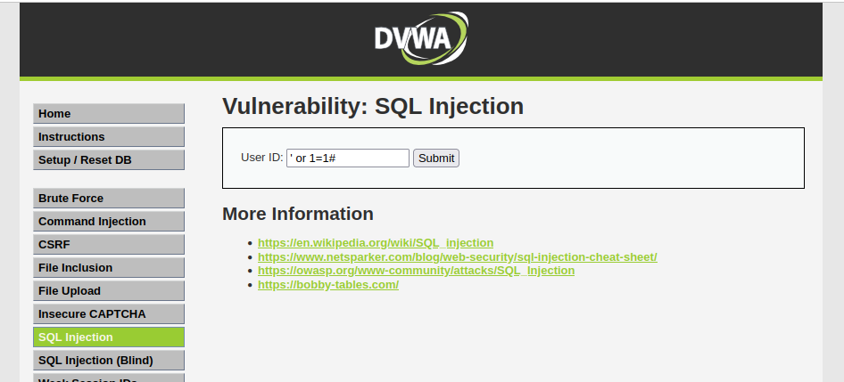

Payload sử dụng phép toán **tautology** (điều kiện luôn đúng) kết hợp ký tự chú thích `#`
để phá vỡ logic truy vấn SQL gốc, cho phép vượt qua cơ chế xác thực hoặc trích xuất toàn
bộ dữ liệu từ bảng `users`.

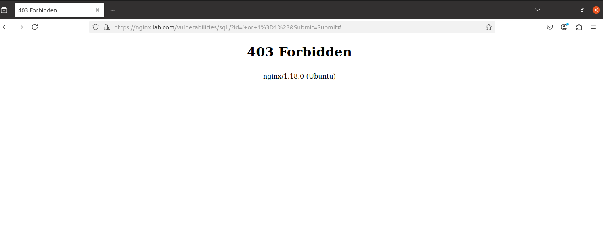

**Kết quả:** `403 Forbidden`. Bộ máy phân tích của ModSecurity nhận diện chính xác các dấu
hiệu bất thường trong tham số truyền dẫn dựa trên ruleset đã cấu hình.

### 3.3.2. XSS DOM

**Payload:** `<script>alert(...)</script>` và `<svg onload=alert(...)>`

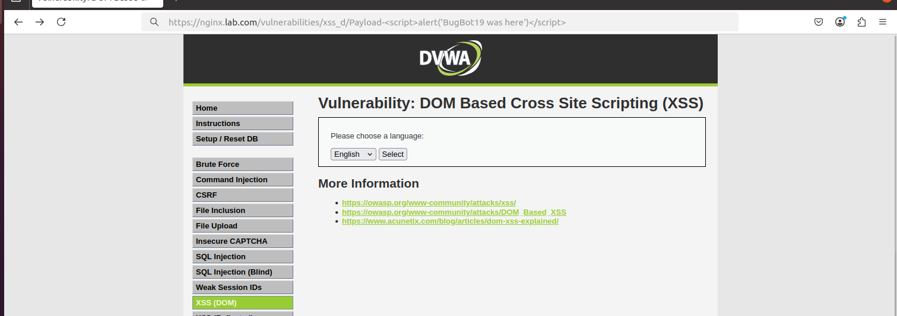

Hai biến thể được dùng có chủ đích để kiểm chứng độ nhạy của bộ luật: kẻ tấn công thường
dùng sự kiện HTML như `onload` thay cho thẻ `<script>` truyền thống nhằm bypass các bộ lọc
cơ bản chỉ tìm chuỗi "script".

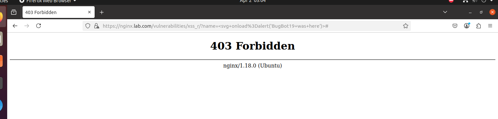

**Kết quả:** `403 Forbidden` cho **cả hai** biến thể. Chặn tại lớp biên ngăn hoàn toàn việc
mã độc được tải về và thực thi trên trình duyệt người dùng cuối.

### 3.3.3. XSS Reflected

**Payload:** `<script>alert('BugBot19 was here')</script>`

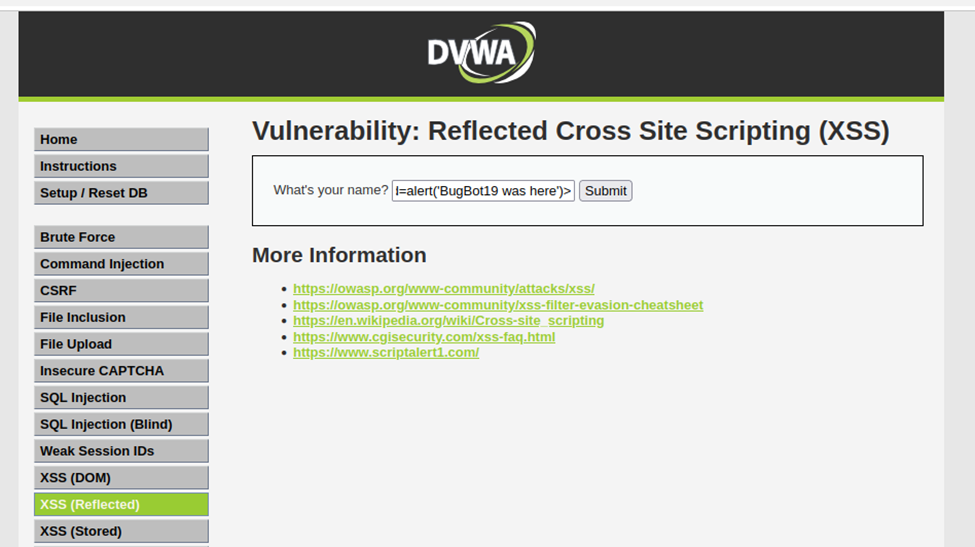

Không có lớp bảo vệ, backend sẽ phản hồi lại chính chuỗi mã này, khiến trình duyệt thực thi
`alert()` và mở ra nguy cơ chiếm hữu phiên làm việc.


**Kết quả:** `403 Forbidden`. Sự kiện đồng thời được Splunk SIEM ghi nhận và phân loại,
làm cơ sở để SOAR kích hoạt Playbook cấm IP trên pfSense với các thực thể tấn công lặp lại.

### 3.3.4. XSS Stored

**Payload:** ``

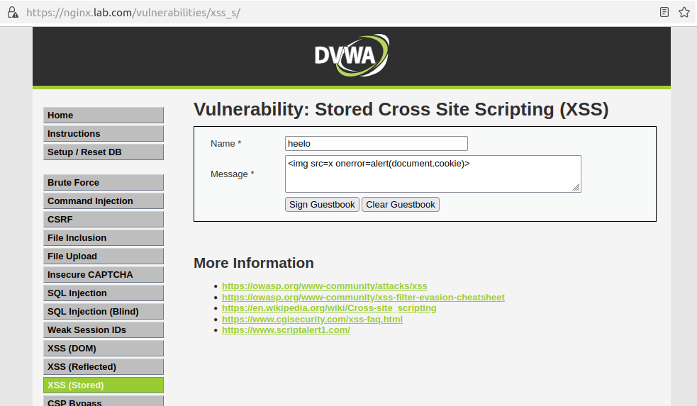

Đây là kỹ thuật bypass phổ biến: thay vì dùng thẻ `<script>` trực diện, kẻ tấn công lợi
dụng sự kiện `onerror` của thẻ hình ảnh để thực thi JavaScript đánh cắp Cookie.

Stored XSS nguy hiểm hơn các biến thể khác vì nếu thành công, mã độc được lưu **vĩnh viễn**
vào cơ sở dữ liệu và tự động thực thi trên trình duyệt của **mọi** người dùng xem trang
sau đó — bao gồm cả quản trị viên.

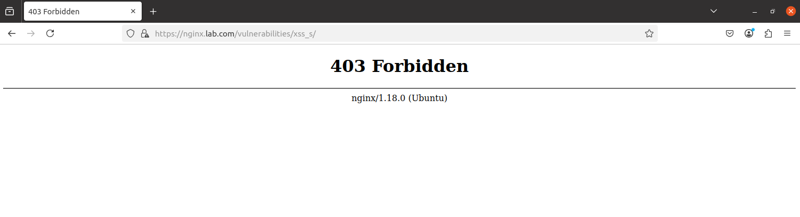

**Kết quả:** `403 Forbidden`. Ngăn triệt để việc mã độc được lưu vào backend, tránh rủi ro
"ô nhiễm" cơ sở dữ liệu của tổ chức.

### 3.3.5. CSP Bypass

**Payload:** `<script>alert(1)</script>` vào phân hệ CSP Bypass

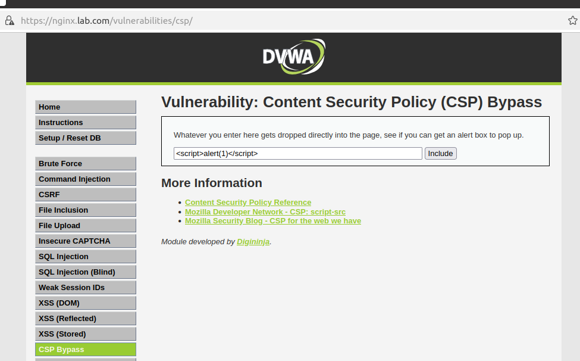

Content Security Policy là tầng bảo mật bổ sung giúp trình duyệt giảm thiểu XSS. Nhưng
trong thực tế, cấu hình CSP lỏng lẻo hoặc lỗ hổng logic thường bị khai thác để thực thi mã
trái phép.

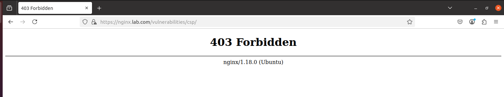

**Kết quả:** `403 Forbidden`. Thay vì để yêu cầu chuyển tiếp và **phụ thuộc vào sự may rủi**
của chính sách an ninh tại backend, NGINX chủ động nhận diện bản chất hành vi tiêm kịch bản
và chấm dứt phiên làm việc ngay tại biên.

### 3.3.6. Command Injection

**Payload:** `127.0.0.1 | ls`

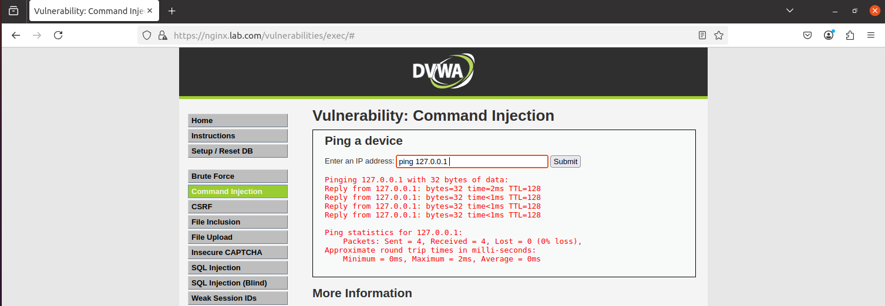

Ở trạng thái chuẩn, chức năng Ping của DVWA nhận một địa chỉ IPv4 hợp lệ và trả về kết quả
bình thường.

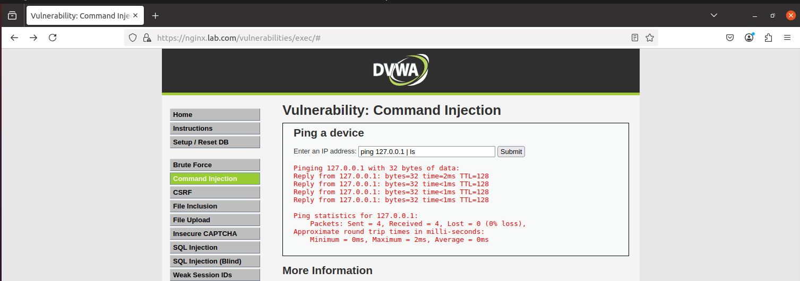

Rủi ro phát sinh khi kẻ tấn công chèn các toán tử nối lệnh của Unix/Linux — `|`, `;`, `&` —
để buộc máy chủ thực thi lệnh tùy ý ngay sau lệnh ping.


**Kết quả:** `403 Forbidden`. Chuỗi lệnh độc hại không có cơ hội tiếp cận shell của máy
chủ backend.

### 3.3.7. JavaScript Attack

**Payload:** chèn các hàm `md5()`, `rot13()` và toán tử gán trực tiếp

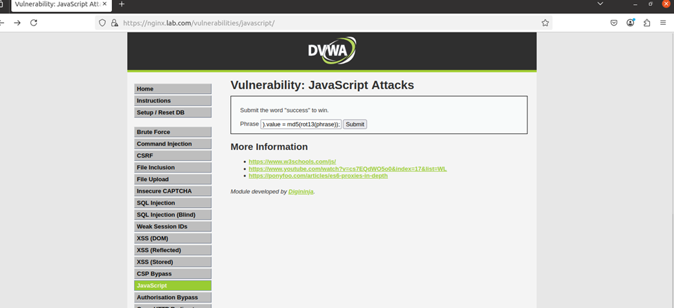

Trong các ứng dụng web hiện đại, kịch bản thực thi tại trình duyệt để xử lý và mã hóa sơ
bộ dữ liệu là rất phổ biến — cũng chính là kẽ hở để thao túng tham số hoặc bypass các bước
kiểm tra logic trước khi dữ liệu được gửi về máy chủ.

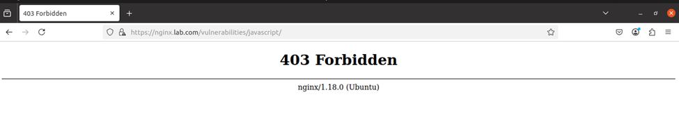

**Kết quả:** `403 Forbidden`. ModSecurity phân loại đây là hành vi **Script Injection**
tiềm ẩn, bảo vệ tính đúng đắn của quy trình nghiệp vụ tại backend.

### 3.3.8. Tấn công DDoS

Đây là kịch bản duy nhất có **nhóm đối chứng đầy đủ**, và vì vậy là kết quả có giá trị
khoa học cao nhất của đề tài.

#### Giai đoạn 1 — Trạng thái bình thường

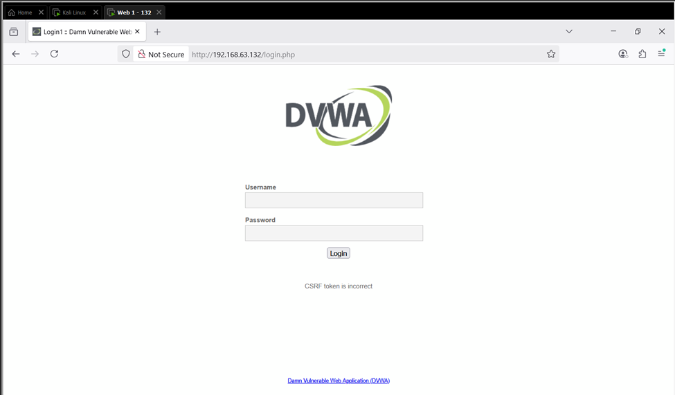

DVWA tại backend `192.168.63.132` vận hành ổn định, người dùng truy cập và tương tác bình
thường.

#### Giai đoạn 2 — Tấn công trực tiếp vào backend (đối chứng)

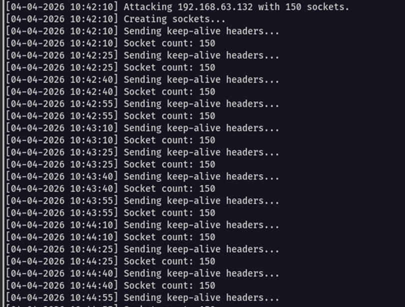

Kẻ tấn công từ Kali Linux duy trì đồng thời **150 sockets** nhắm trực tiếp vào IP backend.

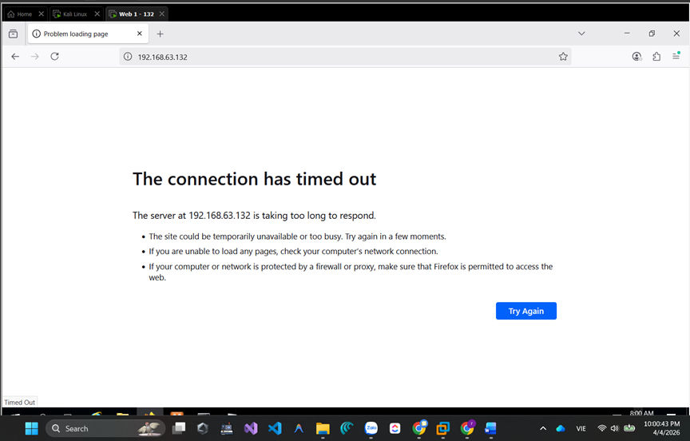

**Kết quả:** Do thiếu lớp tiền kiểm, tài nguyên xử lý của backend nhanh chóng bị chiếm
dụng hoàn toàn. Dịch vụ tê liệt, trình duyệt trả về **`The connection has timed out`**.

Tấn công từ chối dịch vụ **thành công** đối với hệ thống không có bảo vệ.

#### Giai đoạn 3 — Tấn công qua NGINX Reverse Proxy

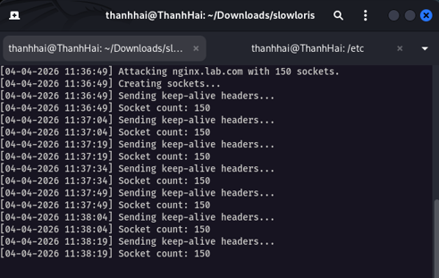

Cùng cường độ tấn công, nhưng lộ trình truy cập bắt buộc đi qua Reverse Proxy. Ba cơ chế
phối hợp:

1. **Connection Limiting** và **Rate Limiting** trên NGINX sàng lọc và bẻ gãy các yêu cầu
   vượt ngưỡng
2. **Splunk SIEM** ghi nhận sự gia tăng đột biến của truy vấn nghi vấn
3. **Splunk SOAR** kích hoạt playbook cập nhật danh sách chặn lên pfSense

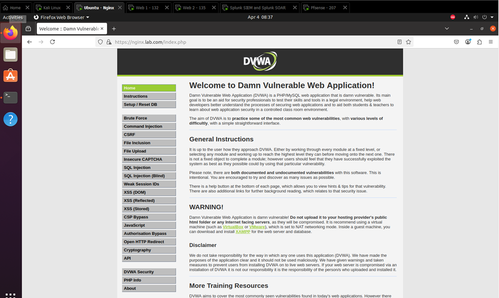

**Kết quả:** Mặc dù máy Kali **vẫn đang duy trì cường độ tấn công**, người dùng hợp lệ vẫn
truy cập giao diện DVWA một cách mượt mà.

Đây là bằng chứng trực tiếp: cùng một cuộc tấn công, cùng một cường độ, khác biệt duy nhất
là sự hiện diện của lớp Reverse Proxy.

#### Phân tích log trên Splunk

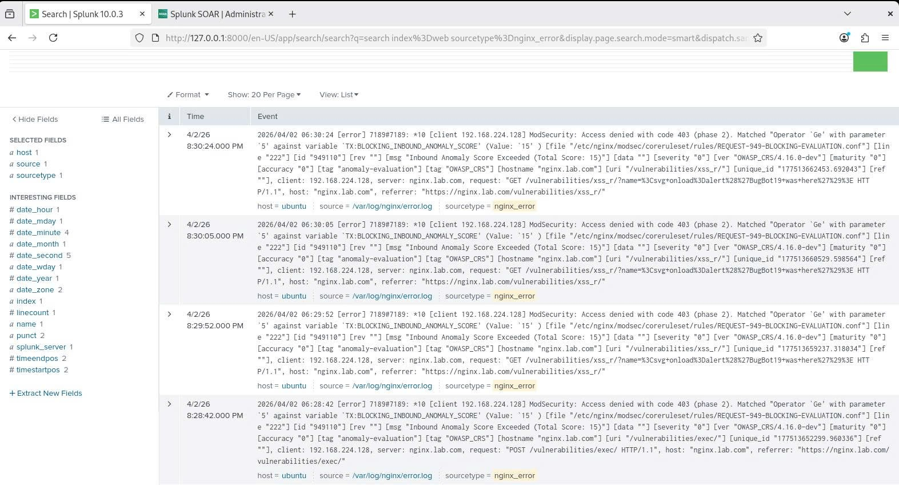

Kết quả đáng chú ý nhất là việc xác thực cơ chế **Anomaly Scoring Mode** của OWASP CRS.
Nhật ký ghi nhận:

```
Inbound Anomaly Score Exceeded (Total Score: 15)
```

Với ngưỡng chặn được thiết lập là **5**, điểm số **15** chứng minh request của kẻ tấn công
chứa **nhiều dấu hiệu vi phạm cộng dồn**, chứ không phải khớp đơn lẻ một luật. Đây là điểm
khác biệt giữa một WAF vận hành thông minh và một bộ lọc chuỗi đơn giản: nó giảm mạnh false
positive vì một request hợp lệ hiếm khi vi phạm nhiều luật cùng lúc.

Splunk cho phép bóc tách chi tiết từng vector:

| Trường | Giá trị ghi nhận |
|---|---|
| IP nguồn | `192.168.224.128` |
| Đường dẫn bị nhắm | `/vulnerabilities/xss_r/` (XSS), `/vulnerabilities/exec/` (Command Injection) |
| Tập luật kích hoạt | `REQUEST-949-BLOCKING-EVALUATION.conf` |
| Điểm anomaly | 15 (ngưỡng: 5) |

---

## Tổng hợp kết quả

| # | Kịch bản | Kết quả | Lớp chặn |
|---|---|---|---|
| 1 | SQL Injection | `403` | ModSecurity CRS |
| 2 | XSS DOM | `403` | ModSecurity CRS |
| 3 | XSS Reflected | `403` | ModSecurity CRS |
| 4 | XSS Stored | `403` | ModSecurity CRS |
| 5 | CSP Bypass | `403` | ModSecurity CRS |
| 6 | Command Injection | `403` | ModSecurity CRS |
| 7 | JavaScript Attack | `403` | ModSecurity CRS |
| 8 | DDoS / Slowloris | Dịch vụ duy trì | `limit_conn` + Fail2Ban + SOAR→pfSense |

---

→ Tiếp theo: [Chương 4 — Kết luận và hướng phát triển](04-ket-luan.md)
