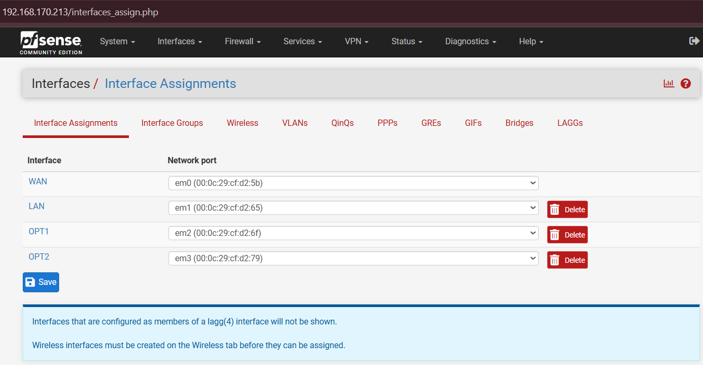
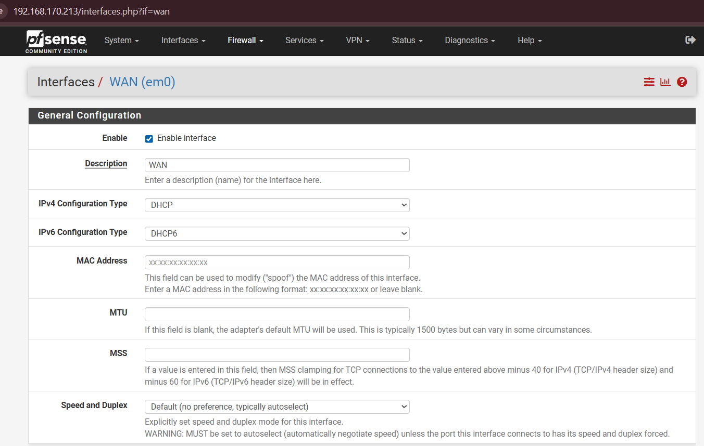
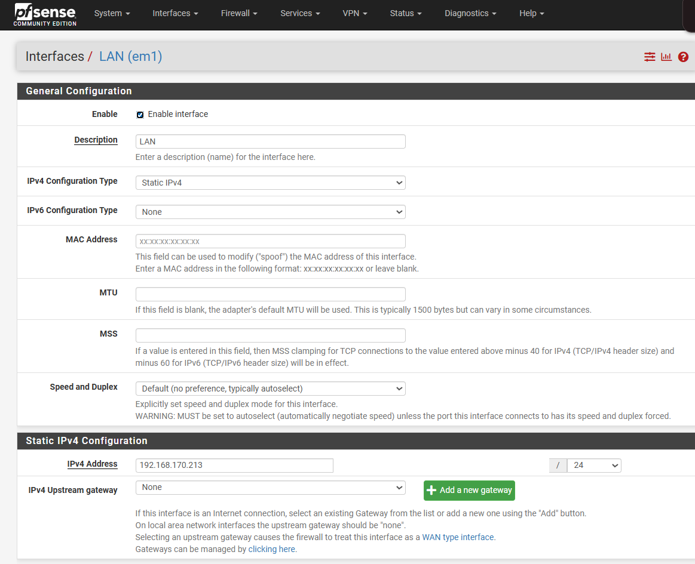
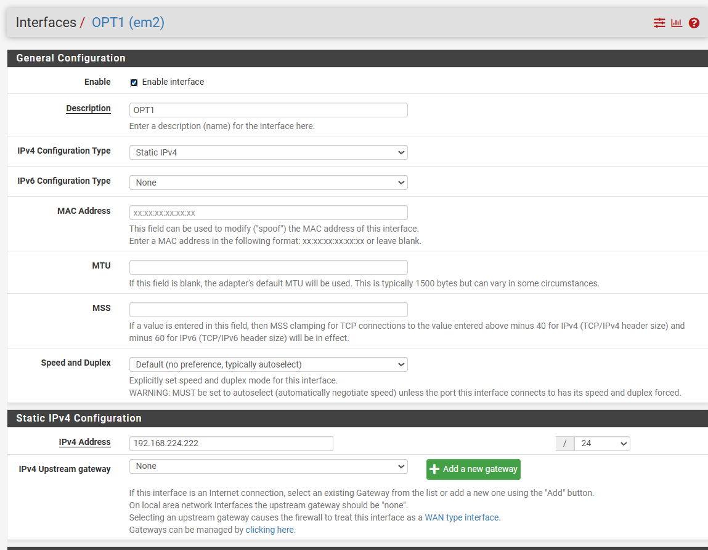
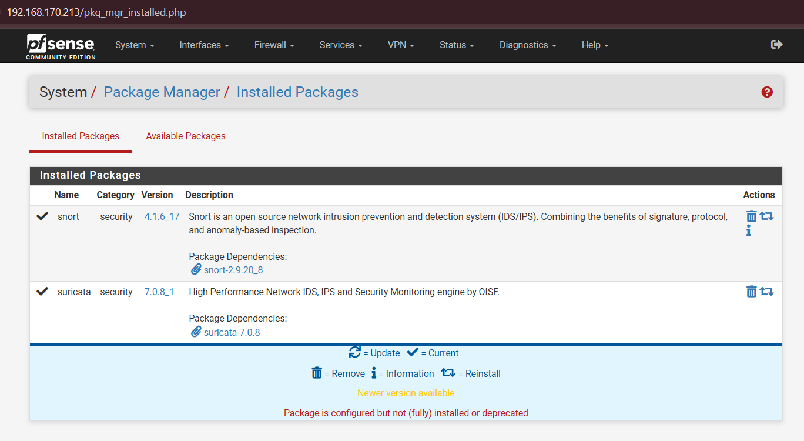
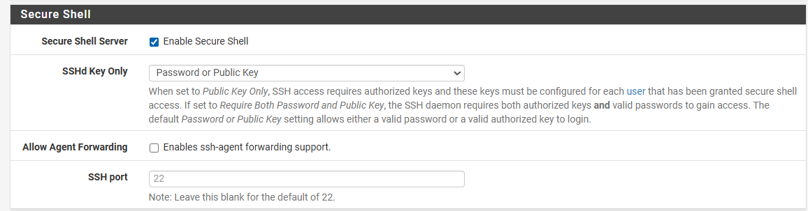

# 01 — pfSense: tường lửa biên và IDS/IPS

Tầng phòng thủ đầu tiên. Nhiệm vụ: phân đoạn mạng, lọc gói tin tầng 3/4, và cung cấp
IDS/IPS.

## 1. Gán giao diện mạng

Sau khi cài pfSense 2.7.2, màn hình console hỏi gán interface. Ánh xạ bốn card:

| Giao diện logic | Card | Vai trò |
|---|---|---|
| WAN | `em0` | Cửa ngõ duy nhất từ Internet |
| LAN | `em1` | Backend Windows Server |
| OPT1 | `em2` | DMZ — NGINX Reverse Proxy |
| OPT2 | `em3` | MGMT — Splunk SIEM/SOAR |



Việc tách bốn vùng hiện thực hóa nguyên lý **Least Privilege**: mỗi vùng có bộ quy tắc
riêng, và một sự cố ở vùng này không leo thang sang vùng khác.

## 2. Cấu hình WAN

**Interfaces → WAN**



- IPv4 Configuration Type: **DHCP**
- IPv6 Configuration Type: **DHCP6**
- MTU / MSS: **để trống** (dùng mặc định)

Giữ MTU mặc định là có chủ đích. Thay đổi MTU dẫn tới phân mảnh gói tin, và một payload
tấn công bị chia làm nhiều mảnh có thể lọt qua WAF vì WAF chỉ thấy từng mảnh rời rạc.

Trong môi trường lab, **bỏ tick** hai mục sau để pfSense không chặn dải RFC1918 mà ta đang
dùng:

- ☐ Block private networks and loopback addresses
- ☐ Block bogon networks

## 3. Cấu hình LAN

**Interfaces → LAN**



- IPv4 Configuration Type: **Static IPv4**
- IPv4 Address: `192.168.170.213` / `24`
- IPv4 Upstream Gateway: **None**

Đặt `None` cho Upstream Gateway là điểm dễ sai. pfSense chính là gateway của vùng này —
khai báo thêm một gateway phía trên sẽ tạo vòng lặp định tuyến và khiến lưu lượng nội bộ
đi vòng qua bộ lọc thay vì xuyên qua nó.

IP tĩnh là bắt buộc: quy tắc firewall, định tuyến và cấu hình forwarder của Splunk đều
tham chiếu theo địa chỉ này.

## 4. Cấu hình DMZ (OPT1)

**Interfaces → OPT1**



- Enable: ☑
- Description: `DMZ`
- IPv4 Configuration Type: **Static IPv4**
- IPv4 Address: `192.168.224.222` / `24`
- IPv4 Upstream Gateway: **None**

Lặp lại tương tự cho **OPT2** với địa chỉ `192.168.121.1/24`, description `MGMT`.

## 5. Quy tắc tường lửa

**Firewall → Rules**. Đây là phần quyết định giá trị của việc phân đoạn mạng — nếu để
`allow any to any`, bốn vùng vừa tạo trở nên vô nghĩa.

### WAN

Chỉ mở HTTP/HTTPS về phía NGINX trong DMZ.

| Action | Protocol | Source | Destination | Port |
|---|---|---|---|---|
| Pass | TCP | any | `192.168.224.222` | 80, 443 |

Kèm NAT port forward: **Firewall → NAT → Port Forward**, chuyển 80/443 từ WAN về
`192.168.224.222`.

### DMZ (OPT1)

Đây là ruleset quan trọng nhất. NGINX **chỉ** được nói chuyện với backend qua HTTP và với
Splunk qua cổng forwarder — không hơn.

| Action | Protocol | Source | Destination | Port | Ghi chú |
|---|---|---|---|---|---|
| Pass | TCP | DMZ net | `192.168.63.0/24` | 80 | Proxy → backend |
| Pass | TCP | DMZ net | `192.168.121.160` | 9997 | Forwarder → Splunk |
| Pass | TCP | DMZ net | any | 80, 443 | Cập nhật gói, tải CRS |
| **Block** | any | DMZ net | LAN net | any | Chặn mọi truy cập khác vào LAN |

Quy tắc Block cuối cùng là thứ biến DMZ thành DMZ thật. Nếu NGINX bị chiếm quyền, kẻ tấn
công vẫn bị kẹt lại.

> Thứ tự quy tắc trong pfSense có ý nghĩa: luật khớp **đầu tiên** sẽ được áp dụng. Đặt các
> luật Pass cụ thể lên trên luật Block tổng quát.

### MGMT (OPT2)

| Action | Protocol | Source | Destination | Port | Ghi chú |
|---|---|---|---|---|---|
| Pass | TCP | MGMT net | `192.168.224.222` | 22 | SOAR → SSH vào NGINX |
| Pass | TCP | MGMT net | `192.168.170.213` | 443 | SOAR → REST API pfSense |

## 6. Cài Snort và Suricata

**System → Package Manager → Available Packages**



Cài cả hai. Đây không phải dư thừa mà là bù trừ điểm mạnh: Snort chính xác nhưng đơn
luồng, Suricata đa luồng nhưng tốn tài nguyên hơn.

### Cấu hình Snort

**Services → Snort → Snort Interfaces → Add**

- Interface: **WAN**
- Enable: ☑
- Block Offenders: ☑ *(bật sau khi đã chạy vài ngày ở chế độ chỉ cảnh báo)*

> Bật `Block Offenders` ngay từ đầu là sai lầm phổ biến. Snort mặc định có nhiều luật gây
> false positive; bật chặn ngay sẽ khóa chính lưu lượng hợp lệ của bạn. Chạy ở chế độ
> alert trước, xem log vài ngày, loại bỏ luật gây nhiễu, rồi mới bật chặn.

### Nạp luật tự viết

Copy nội dung [`configs/snort/local.rules`](../../configs/snort/local.rules) vào:

**Services → Snort → WAN → LAN Rules** (hoặc tab *Rules* → chọn `local.rules`)

Đặt biến `$HOME_NET` gồm cả ba dải nội bộ:

```
192.168.170.0/24, 192.168.224.0/24, 192.168.121.0/24, 192.168.63.0/24
```

### Suricata

**Services → Suricata → Interfaces → Add**, gán vào interface **OPT1 (DMZ)** thay vì WAN
để hai động cơ không cùng phân tích một luồng và tranh tài nguyên.

## 7. Bật SSH

Cần cho bước Splunk SOAR ở [tài liệu 06](06-splunk-siem-soar.md).

**System → Advanced → Admin Access → Secure Shell**



- Enable Secure Shell: ☑
- SSHd Key Only: **Password or Public Key**
- SSH Port: `22`

## 8. Kiểm tra

Từ máy NGINX trong DMZ:

```bash
ping -c 3 192.168.224.222        # gateway DMZ — phải thông
ping -c 3 192.168.63.132         # backend — phải thông
ping -c 3 8.8.8.8                # ra ngoài — phải thông
```

Từ máy NGINX, thử một cổng **không** được phép (ví dụ SMB về backend):

```bash
nc -zv 192.168.63.132 445        # phải bị từ chối
```

Nếu lệnh cuối vẫn thông, quy tắc Block trên DMZ chưa có hiệu lực — kiểm tra lại thứ tự
luật.

---

→ Tiếp theo: [02 — NGINX Reverse Proxy](02-nginx-reverse-proxy.md)
