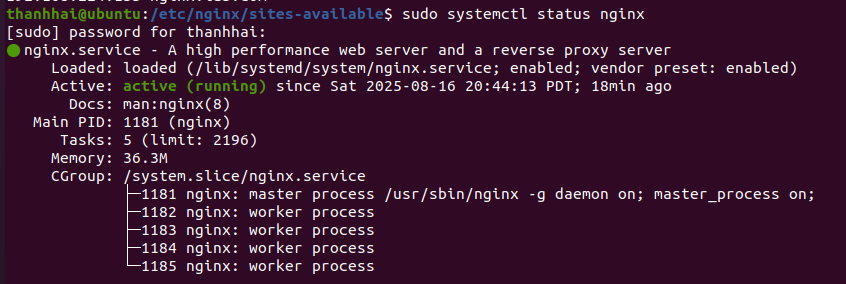
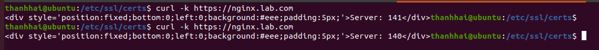
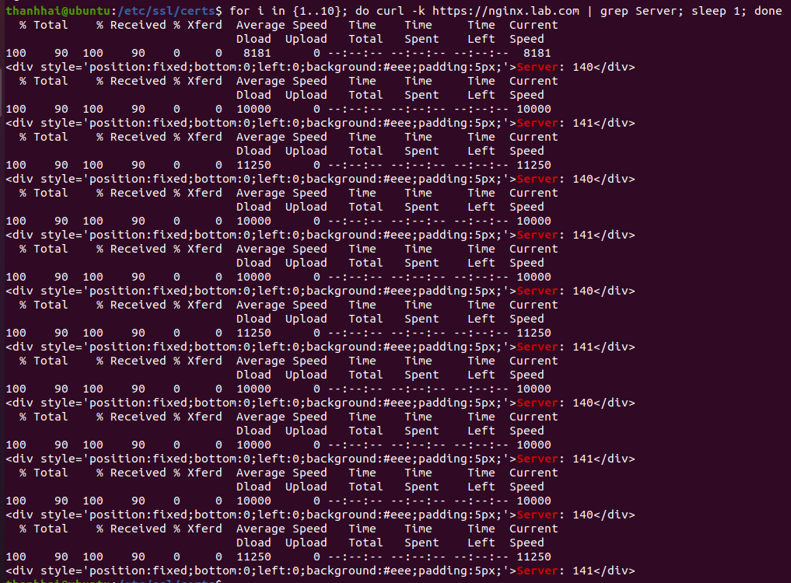

# 02 — NGINX Reverse Proxy và Load Balancer

Thực hiện trên máy `nginx-proxy` (Ubuntu Server 22.04, `192.168.121.142`).

> **Lưu ý trước khi bắt đầu:** nếu bạn dự định cài ModSecurity ở
> [bước 03](03-modsecurity-waf.md), hãy đọc phần đó trước. ModSecurity đòi hỏi NGINX phải
> được **biên dịch từ source** đúng phiên bản. Cài `nginx` bằng `apt` rồi mới biên dịch lại
> sau sẽ dẫn tới lệch phiên bản và module `.so` không nạp được.

## 1. Chuẩn bị môi trường

Apache2 và NGINX đều dùng cổng 80. Thay vì đổi cổng, gỡ hẳn Apache:

```bash
sudo apt remove --purge apache2 -y
sudo apt autoremove -y
```

Cập nhật hệ thống:

```bash
sudo apt update
sudo apt upgrade -y
```

> `apt full-upgrade` có thể gỡ bỏ một số gói để hoàn tất nâng cấp. Dùng `upgrade` thường
> sẽ an toàn hơn trong môi trường đã cấu hình.

## 2. Cài NGINX

```bash
sudo apt install nginx -y
sudo systemctl start nginx
sudo systemctl enable nginx
sudo systemctl status nginx
```



Kết quả mong đợi: trạng thái `active (running)`, với một tiến trình **master** và nhiều
tiến trình **worker**. Master chạy bằng quyền root để bind cổng 80/443, còn worker hạ
quyền xuống `www-data` — đây là thiết kế bảo mật của NGINX.

## 3. Cấu hình Reverse Proxy cơ bản

```bash
sudo vi /etc/nginx/sites-available/reverse_proxy
```

Cấu hình tối thiểu để hiểu cơ chế:

```nginx
server {
    listen 80;
    server_name 192.168.121.142;

    location / {
        proxy_pass http://192.168.63.132;

        proxy_set_header Host              $host;
        proxy_set_header X-Real-IP         $remote_addr;
        proxy_set_header X-Forwarded-For   $proxy_add_x_forwarded_for;
        proxy_set_header X-Forwarded-Proto $scheme;
        proxy_set_header X-Forwarded-Host  $host;
        proxy_set_header X-Forwarded-Port  $server_port;
    }
}
```

Bốn dòng `proxy_set_header` không phải tùy chọn. Không có chúng, backend và Splunk chỉ
thấy IP của proxy trên mọi request — bạn mất hoàn toàn khả năng truy vết nguồn tấn công,
và Fail2Ban sẽ ban chính địa chỉ của proxy.

Kích hoạt:

```bash
sudo ln -s /etc/nginx/sites-available/reverse_proxy /etc/nginx/sites-enabled/
sudo nginx -t
sudo systemctl restart nginx
```

Luôn chạy `nginx -t` **trước** khi restart. Nếu cấu hình sai mà restart, dịch vụ sẽ chết
và không tự khởi động lại.

Gỡ một cấu hình lỗi:

```bash
sudo rm /etc/nginx/sites-enabled/<tên_file>
```

Chỉ xóa symlink trong `sites-enabled`, file gốc trong `sites-available` vẫn còn.

## 4. Cấu hình Load Balancer

Load balancer cần **hai** backend để có gì mà cân bằng. Xem
[05 — Backend DVWA](05-backend-dvwa.md) để dựng chúng.

```nginx
upstream dvwa_backend {
    ip_hash;

    server 192.168.63.132:80 max_fails=3 fail_timeout=30s;
    server 192.168.63.135:80 max_fails=3 fail_timeout=30s;

    keepalive 32;
}

server {
    listen 80;
    server_name nginx.lab.com;

    location / {
        proxy_pass http://dvwa_backend;
        proxy_http_version 1.1;
        proxy_set_header Connection "";
        proxy_set_header Host            $host;
        proxy_set_header X-Real-IP       $remote_addr;
        proxy_set_header X-Forwarded-For $proxy_add_x_forwarded_for;

        proxy_next_upstream error timeout http_502 http_503 http_504;
    }
}
```

### Chọn thuật toán nào

| Thuật toán | Cú pháp | Khi nào dùng |
|---|---|---|
| Round Robin | *(mặc định)* | Ứng dụng stateless, chia tải đều nhất |
| Least Connections | `least_conn;` | Request có thời gian xử lý chênh lệch lớn |
| IP Hash | `ip_hash;` | Ứng dụng lưu session cục bộ |

Đề tài chọn **`ip_hash`** vì DVWA lưu session PHP trên đĩa của từng máy. Với Round Robin,
người dùng đăng nhập ở backend 1 rồi request kế tiếp rơi vào backend 2 sẽ bị đăng xuất.

Đánh đổi: tải **không** chia đều 50/50 mà phụ thuộc phân bố IP nguồn. Đây là hành vi đúng,
không phải lỗi.

### Health check thụ động

`max_fails=3 fail_timeout=30s` nghĩa là: nếu một backend trả lỗi 3 lần trong 30 giây, NGINX
coi nó là chết và ngừng gửi request trong 30 giây tiếp theo.

`proxy_next_upstream` bổ sung thêm: khi gặp lỗi, thử ngay backend còn lại trong cùng
request đó, nên người dùng không thấy trang lỗi.

## 5. Bật HTTPS

Tạo chứng chỉ theo [00 — Chuẩn bị](00-chuan-bi.md#chứng-chỉ-tls-tự-cấp-phát), rồi:

```nginx
server {
    listen 80;
    server_name nginx.lab.com;
    return 301 https://$host$request_uri;
}

server {
    listen 443 ssl http2;
    server_name nginx.lab.com;

    ssl_certificate     /etc/nginx/ssl/nginx.lab.com.crt;
    ssl_certificate_key /etc/nginx/ssl/nginx.lab.com.key;
    ssl_protocols       TLSv1.2 TLSv1.3;
    ssl_ciphers         HIGH:!aNULL:!MD5;

    # ... phần location như trên
}
```

## 6. Bật chống DDoS tầng 7

Các chỉ thị `limit_req_zone` phải nằm trong block `http {}`, nên đặt ở `conf.d/` chứ không
phải trong `server {}`:

```bash
sudo vi /etc/nginx/conf.d/rate-limit.conf
```

Copy nội dung từ
[`configs/nginx/conf.d/rate-limit.conf`](../../configs/nginx/conf.d/rate-limit.conf).

Rồi trong block `server {}`, áp dụng:

```nginx
limit_req  zone=req_per_ip burst=20 nodelay;
limit_conn conn_per_ip 10;
```

Phân biệt hai chỉ thị này rất quan trọng:

- **`limit_req`** giới hạn *số request mỗi giây* → chặn **HTTP Flood**
- **`limit_conn`** giới hạn *số kết nối đồng thời* → chặn **Slowloris**

Slowloris không gửi nhiều request mà mở nhiều kết nối rồi giữ chúng nửa vời. `limit_req`
một mình hoàn toàn không chặn được nó.

Tham số `burst=20 nodelay` cho phép bùng phát ngắn 20 request vượt ngưỡng mà không bị
chặn — cần thiết vì một trang web bình thường tải hàng chục file CSS/JS/ảnh cùng lúc.

## 7. Cấu hình hoàn chỉnh

File cấu hình đầy đủ dùng trong nghiên cứu, gồm cả ModSecurity và điểm nối với SOAR:

→ [`configs/nginx/sites-available/reverse_proxy.conf`](../../configs/nginx/sites-available/reverse_proxy.conf)
→ [`configs/nginx/nginx.conf`](../../configs/nginx/nginx.conf)

## 8. Kiểm chứng Load Balancer

Gán nhãn nhận diện cho từng backend. Sửa `C:\xampp\htdocs\DVWA\index.php` trên mỗi máy,
thêm vào đầu file:

```php
<?php echo "Server: 140"; ?>   <!-- backend-1 -->
<?php echo "Server: 141"; ?>   <!-- backend-2 -->
```



```bash
for i in $(seq 1 10); do
  curl -sk https://nginx.lab.com | grep -o "Server: 1[0-9][0-9]"
done
```



Kết quả luân phiên giữa hai server là dấu hiệu load balancer hoạt động.

> Nếu tất cả 10 lần đều trả về cùng một server: đó là `ip_hash` đang làm đúng việc của nó,
> vì mọi request đến từ cùng một IP nguồn. Tạm đổi sang Round Robin (xóa dòng `ip_hash;`)
> để thấy sự luân phiên, rồi bật lại.

---

→ Tiếp theo: [03 — ModSecurity WAF](03-modsecurity-waf.md)
