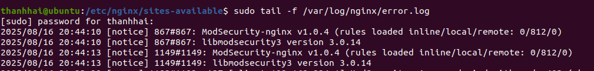

# 03 — ModSecurity WAF và OWASP CRS

Tầng phòng thủ quan trọng nhất của đề tài. ModSecurity không có gói `.deb` dùng được với
NGINX, nên phải **biên dịch từ source**.

> **Quy tắc bất di bất dịch:** phiên bản NGINX dùng để biên dịch module phải **trùng khớp
> chính xác** với phiên bản NGINX đang chạy. Kiểm tra trước bằng `nginx -v`. Lệch dù chỉ
> một số thứ yếu, module `.so` sẽ không nạp được và NGINX từ chối khởi động.

## 1. Cài gói phụ thuộc

```bash
sudo apt update
sudo apt install -y git g++ autoconf automake libtool \
  libcurl4-openssl-dev libxml2 libxml2-dev libpcre3 libpcre3-dev \
  libyajl-dev pkgconf libgeoip-dev doxygen build-essential zlib1g-dev \
  liblmdb-dev libpcre++-dev libssl-dev
sudo apt install -y libpcre2-dev
```

Vai trò của từng nhóm:

| Nhóm | Gói | Dùng để làm gì |
|---|---|---|
| Biên dịch | `git`, `g++`, `autoconf`, `automake`, `libtool`, `build-essential` | Toolchain build |
| Mạng & dữ liệu | `libcurl4-openssl-dev`, `libxml2-dev`, `libyajl-dev` | Parser XML và JSON |
| Mã hóa | `libssl-dev` | Xử lý TLS |
| Regex | `libpcre3-dev`, `libpcre2-dev` | Bộ máy khớp mẫu của luật |
| Địa lý | `libgeoip-dev` | Luật CRS lọc theo quốc gia |
| CSDL | `liblmdb-dev` | Lưu trạng thái giữa các request |

`libyajl-dev` đặc biệt quan trọng: thiếu nó, ModSecurity không parse được JSON và payload
giấu trong JSON body sẽ đi lọt hoàn toàn.

## 2. Biên dịch libmodsecurity

```bash
cd /opt
sudo git clone --depth 1 -b v3/master https://github.com/owasp-modsecurity/ModSecurity
cd ModSecurity
sudo git submodule init && sudo git submodule update
sudo ./build.sh
sudo ./configure
sudo make -j$(nproc)
sudo make install
```

Giải thích các bước:

- `--depth 1` chỉ lấy commit mới nhất, giảm đáng kể dung lượng tải về
- `git submodule update` bắt buộc — ModSecurity phụ thuộc nhiều submodule, bỏ qua bước này
  sẽ lỗi khi build
- `build.sh` sinh ra script `configure`
- `./configure` kiểm tra thư viện có sẵn và tạo Makefile phù hợp
- `-j$(nproc)` biên dịch song song theo số core CPU

Bước này mất 10–20 phút tùy cấu hình máy.

## 3. Biên dịch module ModSecurity-nginx

```bash
cd /opt
sudo git clone --depth 1 https://github.com/owasp-modsecurity/ModSecurity-nginx
```

Đây **không** phải phần lõi mà là extension kết nối libmodsecurity với NGINX.

## 4. Biên dịch NGINX kèm module

Xác định phiên bản NGINX đang chạy:

```bash
nginx -v
```

Tải đúng phiên bản đó (ví dụ 1.18.0):

```bash
cd /opt
sudo wget http://nginx.org/download/nginx-1.18.0.tar.gz
sudo tar -xvzf nginx-1.18.0.tar.gz
cd nginx-1.18.0

sudo ./configure --with-compat --add-dynamic-module=/opt/ModSecurity-nginx
sudo make -j$(nproc)
```

`--with-compat` là cờ then chốt: nó cho phép build module ở dạng dynamic tương thích với
nhiều bản NGINX, thay vì phải thay thế toàn bộ binary NGINX.

> Chỉ chạy `make`, **không** chạy `make install`. Chúng ta chỉ cần file `.so`, không muốn
> ghi đè bản NGINX do `apt` quản lý.

Cài module:

```bash
sudo mkdir -p /etc/nginx/modules-available /etc/nginx/modules-enabled
sudo cp objs/ngx_http_modsecurity_module.so /etc/nginx/modules-available/
sudo ln -s /etc/nginx/modules-available/ngx_http_modsecurity_module.so \
           /etc/nginx/modules-enabled/
```

## 5. Nạp module vào NGINX

Sửa `/etc/nginx/nginx.conf`, thêm dòng sau **ở context chính, trước block `events {}`**:

```nginx
load_module /etc/nginx/modules-enabled/ngx_http_modsecurity_module.so;
```

Vị trí rất quan trọng. `load_module` chỉ hợp lệ ở context cao nhất; đặt trong `http {}`
hoặc sau `events {}` sẽ báo lỗi cú pháp.

## 6. Tạo cấu hình ModSecurity

```bash
sudo mkdir -p /etc/nginx/modsec
sudo cp /opt/ModSecurity/modsecurity.conf-recommended /etc/nginx/modsec/modsecurity.conf
sudo cp /opt/ModSecurity/unicode.mapping /etc/nginx/modsec/
```

Bật chế độ chặn:

```bash
sudo nano /etc/nginx/modsec/modsecurity.conf
```

Tìm và sửa:

```
SecRuleEngine DetectionOnly
```
thành
```
SecRuleEngine On
```

> **Quy trình khuyến nghị:** giữ `DetectionOnly` trong vài ngày đầu, xem
> `/var/log/modsec_audit.log` để phát hiện false positive, loại bỏ các luật gây nhiễu
> bằng `SecRuleRemoveById`, rồi mới chuyển sang `On`. Bật `On` ngay từ đầu trên hệ thống
> thật sẽ chặn nhầm lưu lượng hợp lệ.

Bản cấu hình đầy đủ dùng trong nghiên cứu, kèm giải thích từng tham số:

→ [`configs/modsecurity/modsecurity.conf`](../../configs/modsecurity/modsecurity.conf)

## 7. Nạp OWASP Core Rule Set

```bash
cd /etc/nginx/modsec/
sudo git clone https://github.com/coreruleset/coreruleset.git
cd coreruleset
sudo cp crs-setup.conf.example crs-setup.conf
```

Tạo file điểm vào `main.conf` để gom tất cả include lại:

```bash
sudo nano /etc/nginx/modsec/main.conf
```

```
Include /etc/nginx/modsec/modsecurity.conf
Include /etc/nginx/modsec/unicode.mapping
Include /etc/nginx/modsec/coreruleset/crs-setup.conf
Include /etc/nginx/modsec/coreruleset/rules/*.conf
Include /etc/nginx/modsec/exclusions.conf
```

**Thứ tự có ý nghĩa.** `exclusions.conf` phải nằm cuối cùng vì `SecRuleRemoveById` chỉ tác
dụng lên các luật đã được nạp trước đó.

→ [`configs/modsecurity/main.conf`](../../configs/modsecurity/main.conf)
→ [`configs/modsecurity/exclusions.conf`](../../configs/modsecurity/exclusions.conf)

## 8. Điều chỉnh Paranoia Level và ngưỡng chặn

Trong `crs-setup.conf`:

```
setvar:'tx.paranoia_level=1'
setvar:'tx.inbound_anomaly_score_threshold=5'
```

| Paranoia Level | Đặc điểm |
|---|---|
| **PL1** *(mặc định)* | Ít false positive nhất. Phù hợp production. |
| PL2 | Bắt thêm nhiều biến thể, bắt đầu có false positive. |
| PL3–PL4 | Rất nghiêm ngặt, chỉ dùng cho ứng dụng có input được kiểm soát chặt. |

### Cơ chế Anomaly Scoring

CRS **không** chặn ngay khi một luật khớp. Mỗi luật vi phạm cộng một số điểm theo mức độ
nghiêm trọng; chỉ khi tổng điểm vượt `inbound_anomaly_score_threshold` thì request mới bị
chặn.

Đây là lý do thực nghiệm ghi nhận `Total Score: 15` với ngưỡng `5` — payload SQLi vi phạm
nhiều luật cộng dồn. Một request hợp lệ hiếm khi vi phạm nhiều luật cùng lúc, nên cách này
giảm mạnh false positive so với chặn theo từng luật đơn lẻ.

## 9. Bật ModSecurity trong cấu hình server

Thêm vào block `server {}` của `/etc/nginx/sites-available/reverse_proxy`:

```nginx
modsecurity on;
modsecurity_rules_file /etc/nginx/modsec/main.conf;
```

## 10. Kiểm tra

```bash
sudo nginx -t
sudo systemctl reload nginx
sudo tail -f /var/log/nginx/error.log
```



Kết quả mong đợi trong `error.log`:

```
ModSecurity-nginx v1.0.4 (rules loaded inline/local/remote: 0/812/0)
```

Con số **812** xác nhận CRS đã nạp thành công. Nếu thấy `0/0/0`, đường dẫn `Include` trong
`main.conf` bị sai.

Thử một payload đơn giản:

```bash
curl -k "https://nginx.lab.com/?id=1' OR '1'='1"
```

Kết quả mong đợi: `403 Forbidden`.

## Xử lý sự cố

| Triệu chứng | Nguyên nhân | Cách xử lý |
|---|---|---|
| `module is not binary compatible` | Phiên bản NGINX build ≠ phiên bản đang chạy | Kiểm tra `nginx -v`, tải lại đúng source |
| `unknown directive "modsecurity"` | Module chưa được `load_module` | Kiểm tra dòng `load_module` nằm trước `events {}` |
| `rules loaded: 0/0/0` | Đường dẫn Include sai | Kiểm tra `ls /etc/nginx/modsec/coreruleset/rules/` |
| Chặn nhầm lưu lượng hợp lệ | Paranoia Level quá cao hoặc luật nhiễu | Hạ về PL1, hoặc `SecRuleRemoveById` luật cụ thể |
| `403` trên trang setup DVWA | CRS coi form setup là tấn công | Dùng ngoại lệ trong `exclusions.conf` |

Xác định luật nào đang chặn:

```bash
sudo grep "Access denied" /var/log/modsec_audit.log | tail -5
```

Dòng log chứa `[id "942100"]` cho biết luật ID nào kích hoạt. Loại bỏ nó bằng:

```
SecRuleRemoveById 942100
```

---

→ Tiếp theo: [04 — Fail2Ban](04-fail2ban.md)
