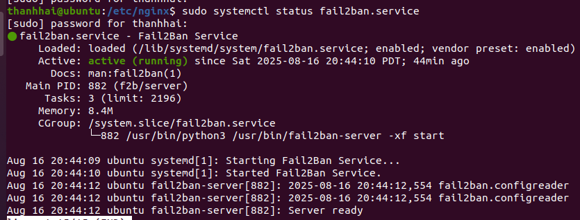

# 04 — Fail2Ban: phản ứng tự động dựa trên nhật ký

ModSecurity chặn **từng request** độc hại. Fail2Ban chặn **cả địa chỉ IP** đang liên tục
gửi request độc hại. Hai lớp bổ sung cho nhau: WAF xử lý nội dung, Fail2Ban xử lý hành vi.

## 1. Cài đặt

```bash
sudo apt update
sudo apt install fail2ban -y
sudo systemctl start fail2ban
sudo systemctl enable fail2ban
```



Mức tiêu thụ ghi nhận trong nghiên cứu: khoảng **8,4 MB** bộ nhớ.

## 2. Đảm bảo NGINX ghi log

Fail2Ban đọc log của NGINX, nên log phải tồn tại và đúng định dạng. Kiểm tra trong
`/etc/nginx/nginx.conf`:

```nginx
access_log /var/log/nginx/access.log;
error_log  /var/log/nginx/error.log warn;
```

Mức `warn` là bắt buộc cho jail `nginx-limit-req`: cảnh báo vượt ngưỡng rate limit được
NGINX ghi ở mức `warn`, nếu đặt `error` thì các dòng này biến mất.

```bash
sudo nginx -t
sudo systemctl restart nginx
```

## 3. Tạo jail.local

**Không bao giờ sửa `jail.conf`** — file này bị ghi đè mỗi lần nâng cấp gói. Fail2Ban đọc
`jail.local` sau và cho nó quyền ghi đè.

```bash
sudo cp /etc/fail2ban/jail.conf /etc/fail2ban/jail.local
sudo nano /etc/fail2ban/jail.local
```

Nội dung đầy đủ dùng trong nghiên cứu:

→ [`configs/fail2ban/jail.local`](../../configs/fail2ban/jail.local)

### Các tham số cốt lõi

| Tham số | Ý nghĩa |
|---|---|
| `maxretry` | Số lần vi phạm trước khi ban |
| `findtime` | Cửa sổ thời gian đếm vi phạm (giây) |
| `bantime` | Thời gian cấm (giây). `-1` = vĩnh viễn |
| `ignoreip` | Danh sách IP không bao giờ bị ban |
| `banaction` | Cơ chế chặn: `nftables-multiport` hoặc `iptables-multiport` |

**Luôn thêm IP của bạn vào `ignoreip`.** Đây là lỗi kinh điển: cấu hình xong, test thử, rồi
tự khóa mình khỏi máy chủ.

```
ignoreip = 127.0.0.1/8 ::1 192.168.121.160
```

`192.168.121.160` là máy Splunk — nếu không loại trừ, các lượt health check định kỳ có thể
khiến nó bị ban và làm đứt luồng log.

## 4. Tạo các filter

Filter là biểu thức regex xác định thế nào là một "lần vi phạm". Nghiên cứu dùng ba filter
tự viết.

### nginx-404 — phát hiện quét lỗ hổng

```bash
sudo nano /etc/fail2ban/filter.d/nginx-404.conf
```

```ini
[Definition]
failregex = ^<HOST> -.*"(GET|POST|HEAD|PUT|DELETE|OPTIONS).*" 404 .*$
ignoreregex = ^<HOST> -.*"GET /(favicon\.ico|robots\.txt|apple-touch-icon.*) HTTP.*" 404 .*$
```

`ignoreregex` rất cần thiết: trình duyệt tự động xin `favicon.ico` và nhiều site không có
file này, tạo ra 404 liên tục từ người dùng hoàn toàn bình thường.

### nginx-modsec — phát hiện IP bị WAF chặn

```bash
sudo nano /etc/fail2ban/filter.d/nginx-modsec.conf
```

```ini
[Definition]
failregex = \[client <HOST>\] ModSecurity: Access denied with code 403
            \[client <HOST>\] ModSecurity: .*Inbound Anomaly Score Exceeded
```

Lưu ý khác biệt về định dạng: trong `access.log`, IP nằm ở **đầu dòng**; trong `error.log`
của ModSecurity, IP nằm trong `[client x.x.x.x]` ở **giữa dòng**. Vì vậy không thể dùng
chung filter cho cả hai file.

### nginx-limit-req — phát hiện HTTP Flood

```bash
sudo nano /etc/fail2ban/filter.d/nginx-limit-req.conf
```

```ini
[Definition]
failregex = ^\s*\[warn\] \d+#\d+: \*\d+ limiting requests, excess: [\d\.]+ by zone "[^"]+", client: <HOST>
            ^\s*\[warn\] \d+#\d+: \*\d+ limiting connections by zone "[^"]+", client: <HOST>
```

Cần **cả hai** dòng: NGINX ghi thông điệp khác nhau cho `limit_req` và `limit_conn`.

→ Toàn bộ filter: [`configs/fail2ban/filter.d/`](../../configs/fail2ban/filter.d/)

## 5. Kiểm tra filter trước khi bật

Đây là bước hay bị bỏ qua nhưng tiết kiệm rất nhiều thời gian debug:

```bash
sudo fail2ban-regex /var/log/nginx/access.log /etc/fail2ban/filter.d/nginx-404.conf
```

Kết quả cho biết filter khớp được bao nhiêu dòng. Nếu là `0 matched`, regex sai — sửa
trước khi bật jail, vì một jail có filter sai sẽ im lặng không làm gì cả.

## 6. Khởi động

```bash
sudo systemctl restart fail2ban
sudo fail2ban-client status
```

Kết quả liệt kê các jail đang hoạt động:

```
Jail list: nginx-404, nginx-modsec, nginx-limit-req, nginx-http-auth, sshd
```

Xem chi tiết một jail:

```bash
sudo fail2ban-client status nginx-modsec
```

## 7. Vận hành hàng ngày

```bash
# Theo dõi hoạt động theo thời gian thực
sudo tail -f /var/log/fail2ban.log

# Gỡ ban một IP bị chặn nhầm
sudo fail2ban-client set nginx-modsec unbanip 192.168.224.100

# Ban thủ công một IP
sudo fail2ban-client set nginx-modsec banip 192.168.224.128

# Xem các luật chặn thực tế trên tường lửa
sudo nft list ruleset | grep f2b
```

## 8. Kết nối với Splunk

Để SOAR sử dụng được dữ liệu ban/unban, thêm `/var/log/fail2ban.log` vào cấu hình
forwarder — đã có sẵn trong
[`configs/splunk/inputs.conf`](../../configs/splunk/inputs.conf).

Từ đó, SOAR có thể mở rộng lệnh chặn từ một máy (Fail2Ban chỉ chặn tại chính máy NGINX) ra
toàn hạ tầng (pfSense chặn ở tầng mạng cho mọi vùng).

## Xử lý sự cố

| Triệu chứng | Nguyên nhân | Cách xử lý |
|---|---|---|
| Jail chạy nhưng không ban ai | Regex không khớp | Chạy `fail2ban-regex` để kiểm tra |
| `Failed to execute ban jail` | Sai `banaction` cho hệ thống | Đổi `nftables-multiport` ↔ `iptables-multiport` |
| Tự khóa chính mình | Thiếu `ignoreip` | Truy cập qua console VM, thêm IP vào `ignoreip` |
| Ban nhầm IP của proxy | Thiếu `X-Real-IP` ở tầng trên | Xem [02 — NGINX](02-nginx-reverse-proxy.md#3-cấu-hình-reverse-proxy-cơ-bản) |

---

→ Tiếp theo: [05 — Backend DVWA](05-backend-dvwa.md)
