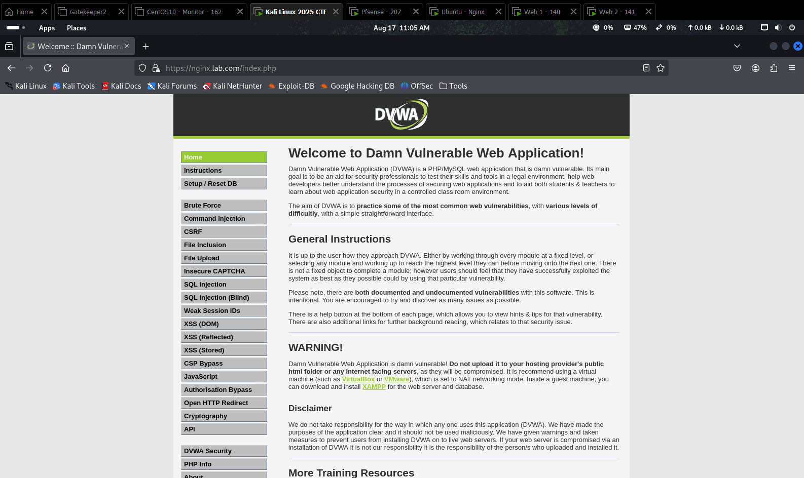
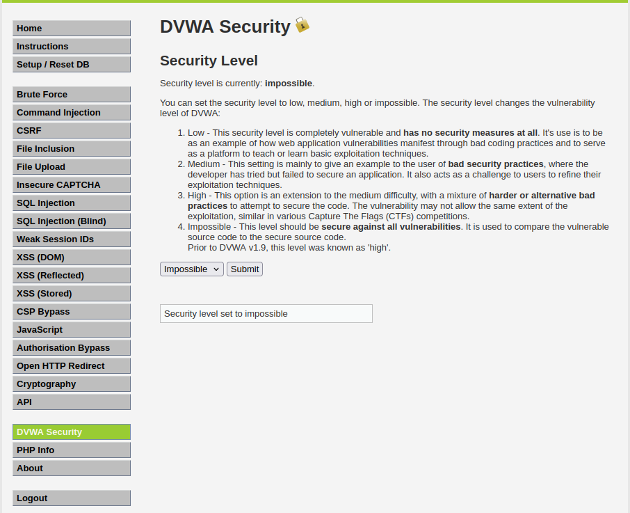

# 05 — Backend: XAMPP và DVWA

Dựng hai máy chủ ứng dụng làm mục tiêu kiểm thử. Cần **hai** máy vì load balancer không có
gì để cân bằng nếu chỉ có một.

> **DVWA là ứng dụng cố ý chứa lỗ hổng.** Chỉ triển khai trong mạng ảo cô lập. Nếu VMnet
> của bạn ở chế độ Bridged thay vì Host-only, máy này sẽ lộ ra mạng LAN thật.

## 1. Cài XAMPP

Trên Windows Server 2016:

1. Tải XAMPP từ https://www.apachefriends.org/
2. Cài vào `C:\xampp` (đường dẫn mặc định — các bước sau giả định đường dẫn này)
3. Mở **XAMPP Control Panel**, khởi động **Apache** và **MySQL**

Nếu Apache không khởi động được, thường là cổng 80 đã bị IIS chiếm. Tắt IIS:

```powershell
Stop-Service W3SVC
Set-Service W3SVC -StartupType Disabled
```

## 2. Cài DVWA

```powershell
cd C:\xampp\htdocs
git clone https://github.com/digininja/DVWA.git
```

Hoặc tải ZIP và giải nén thành `C:\xampp\htdocs\DVWA`.

Tạo file cấu hình:

```powershell
Copy-Item C:\xampp\htdocs\DVWA\config\config.inc.php.dist `
          C:\xampp\htdocs\DVWA\config\config.inc.php
```

Sửa `config.inc.php`, đảm bảo thông tin CSDL khớp với XAMPP (mặc định user `root`, mật
khẩu rỗng):

```php
$_DVWA[ 'db_server' ]   = '127.0.0.1';
$_DVWA[ 'db_database' ] = 'dvwa';
$_DVWA[ 'db_user' ]     = 'root';
$_DVWA[ 'db_password' ] = '';
```

## 3. Khởi tạo cơ sở dữ liệu

Truy cập `http://localhost/DVWA/setup.php`, bấm **Create / Reset Database**.

Tài khoản mặc định: `admin` / `password`.



## 4. Bật các chức năng cần cho kiểm thử

Sửa `C:\xampp\php\php.ini`:

```ini
allow_url_include = On
allow_url_fopen   = On
display_errors    = On
```

`allow_url_include` cần cho kịch bản File Inclusion. Đây là thiết lập **cực kỳ nguy hiểm**
trên hệ thống thật — chỉ bật trong lab.

Khởi động lại Apache sau khi sửa.

## 5. Gán nhãn nhận diện cho load balancer

Để kiểm chứng phân phối tải, thêm vào đầu `C:\xampp\htdocs\DVWA\index.php`:

Trên **backend-1**:
```php
<?php echo "<!-- Server: 140 -->"; ?>
```

Trên **backend-2**:
```php
<?php echo "<!-- Server: 141 -->"; ?>
```

Dùng comment HTML để nhãn không ảnh hưởng giao diện nhưng vẫn đọc được bằng `curl`.

## 6. Cấu hình mạng

Trên mỗi máy, đặt IP tĩnh:

| Máy | IP | Subnet | Gateway |
|---|---|---|---|
| backend-1 | `192.168.63.132` | `255.255.255.0` | `192.168.170.213` |
| backend-2 | `192.168.63.135` | `255.255.255.0` | `192.168.170.213` |

## 7. Chỉ cho phép truy cập từ Reverse Proxy

Đây là bước hiện thực hóa nguyên lý **backend không bao giờ tiếp xúc trực tiếp với
Internet**. Trên Windows Firewall, tạo luật chỉ cho phép cổng 80 từ IP của NGINX:

```powershell
New-NetFirewallRule -DisplayName "Allow HTTP from Reverse Proxy only" `
  -Direction Inbound -Protocol TCP -LocalPort 80 `
  -RemoteAddress 192.168.224.222 -Action Allow

New-NetFirewallRule -DisplayName "Block HTTP from everywhere else" `
  -Direction Inbound -Protocol TCP -LocalPort 80 -Action Block
```

Thứ tự quan trọng: Windows Firewall ưu tiên luật Block, nên cần kiểm tra lại bằng cách
thử truy cập trực tiếp từ Kali — phải thất bại.

> **Ngoại lệ cho kịch bản kiểm thử 8:** kịch bản DDoS đối chứng cần tấn công **trực tiếp**
> vào backend để chứng minh nó sập khi không có proxy. Tạm tắt luật Block khi chạy giai
> đoạn đó, rồi bật lại.

## 8. Nhân bản máy thứ hai

Cách nhanh nhất: clone backend-1 sau khi cài xong, rồi sửa trên bản clone:

1. Đổi hostname (**System Properties → Computer Name**)
2. Đổi IP thành `192.168.63.135`
3. Đổi nhãn `index.php` thành `Server: 141`
4. Chạy lại `setup.php` để khởi tạo CSDL riêng

Bước 4 dễ bị quên. Hai máy phải có CSDL **độc lập** — nếu không, dữ liệu Guestbook dùng
trong kịch bản Stored XSS sẽ không nhất quán giữa hai lần request.

## 9. Cấp độ bảo mật DVWA



DVWA cho phép chọn bốn mức tại **DVWA Security**:

| Mức | Đặc điểm | Dùng để |
|---|---|---|
| **Low** | Không có biện pháp bảo vệ nội tại | Xác nhận payload tấn công thực sự hoạt động |
| Medium | Lọc cơ bản, dễ bypass | Kiểm thử kỹ thuật bypass |
| High | Lọc chặt hơn | — |
| **Impossible** | Mã nguồn gia cố tối đa | Chứng minh WAF là **tầng bảo vệ bổ sung** |

Phương pháp kiểm thử của nghiên cứu dùng hai mức làm nhóm đối chứng:

- Ở mức **Low**, tấn công **trực tiếp** vào backend phải **thành công** — điều này xác
  nhận payload hợp lệ và lỗ hổng thực sự tồn tại.
- Cùng payload đó, đi **qua NGINX**, phải bị chặn `403` — chứng minh WAF hoạt động.

Không có bước đầu, ta không thể phân biệt "WAF đã chặn" với "vốn dĩ không có gì để khai
thác".

## 10. Kiểm tra

Từ máy NGINX:

```bash
curl -s http://192.168.63.132 | head -5
curl -s http://192.168.63.135 | head -5
```

Từ máy Kali (sau khi đã bật luật firewall ở bước 7):

```bash
curl -s --max-time 5 http://192.168.63.132    # phải timeout
curl -sk https://nginx.lab.com                 # phải thành công
```

Kết quả này xác nhận backend chỉ tiếp cận được qua Reverse Proxy — đúng thiết kế.

---

→ Tiếp theo: [06 — Splunk SIEM và SOAR](06-splunk-siem-soar.md)
