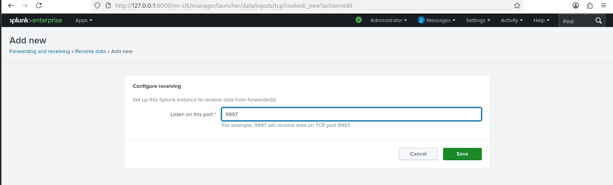
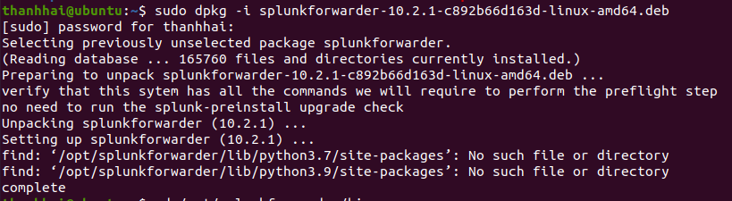
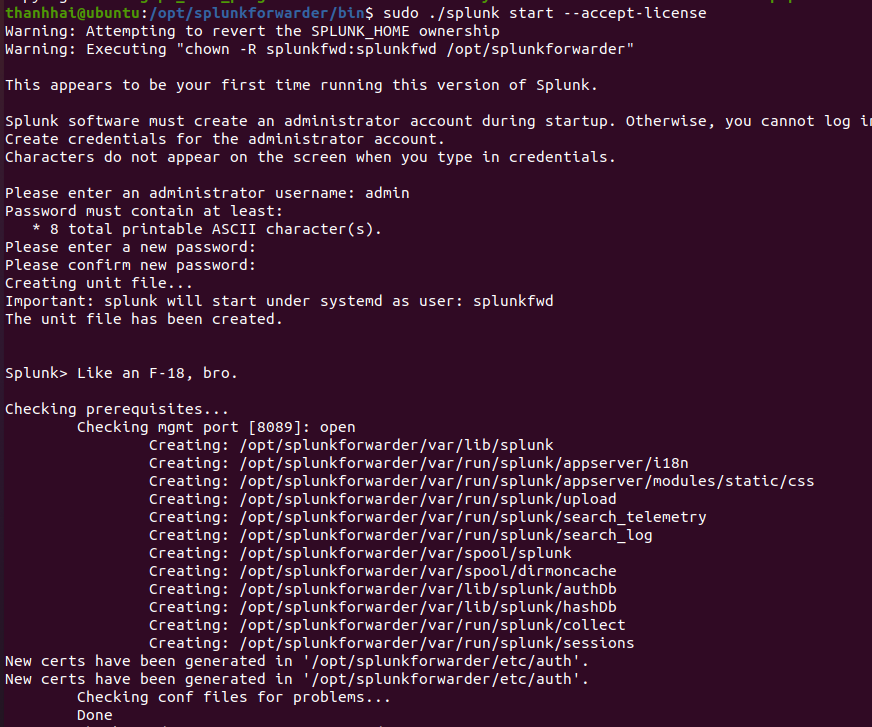
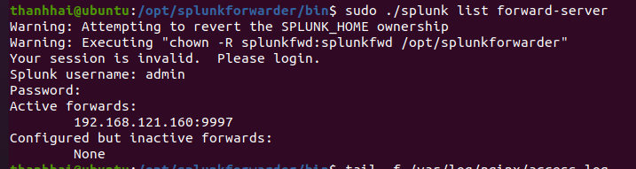
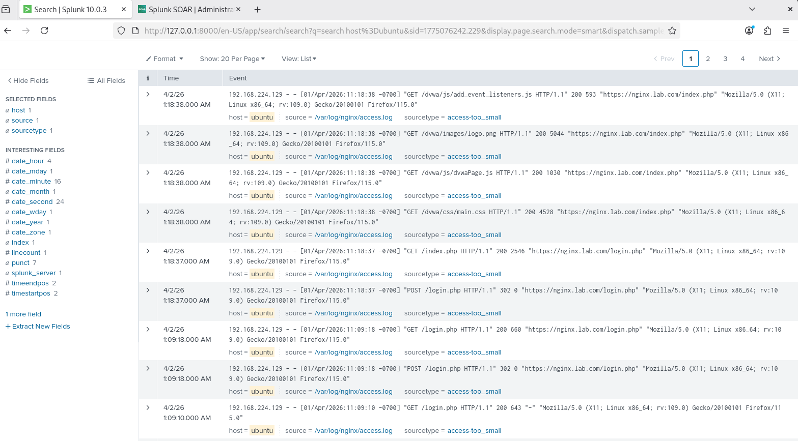
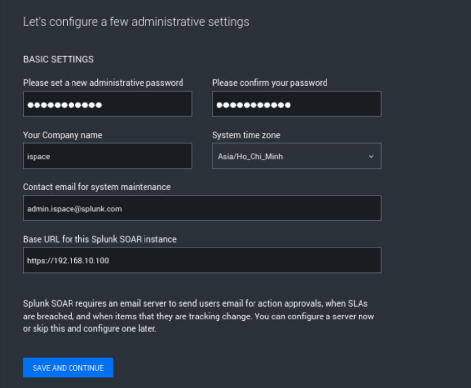
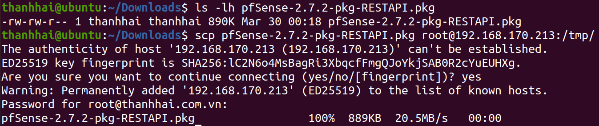

# 06 — Splunk SIEM và SOAR

Tầng cuối cùng, và là thứ khép kín chu trình. SIEM là **mắt nhìn**, SOAR là **cánh tay
thực thi**.

Máy: `splunk-server` (Oracle Linux 9, `192.168.121.160`).

> **Vì sao Oracle Linux?** Splunk SOAR chỉ hỗ trợ bản phân phối RHEL 9. Oracle Linux là
> distro tương thích nhị phân với RHEL, miễn phí. Đây là ràng buộc kỹ thuật, không phải
> lựa chọn sở thích.

## 1. Cài Splunk Enterprise

Tải bản `.rpm` từ https://www.splunk.com/en_us/download/previous-releases.html

```bash
sudo rpm -ivh splunk-<version>-linux-2.6-x86_64.rpm
sudo /opt/splunk/bin/splunk start --accept-license
sudo /opt/splunk/bin/splunk enable boot-start
```

Truy cập giao diện web tại `https://192.168.121.160:8000`.

## 2. Bật cổng nhận log

**Settings → Forwarding and receiving → Configure receiving → New Receiving Port**



Nhập `9997` — cổng tiêu chuẩn của Splunk, tối ưu cho luồng dữ liệu lớn độ trễ thấp.

Hoặc bằng dòng lệnh:

```bash
sudo /opt/splunk/bin/splunk enable listen 9997 -auth admin:<password>
```

## 3. Tạo index

**Settings → Indexes → New Index**

| Index | Dùng cho |
|---|---|
| `web` | access.log, error.log của NGINX |
| `security` | modsec_audit.log, fail2ban.log, auth.log |

Tách hai index giúp phân quyền và đặt chính sách lưu trữ khác nhau — log an ninh thường
cần giữ lâu hơn log truy cập.

## 4. Cài Universal Forwarder trên máy NGINX

Thực hiện trên `nginx-proxy`, không phải trên Splunk server.



```bash
wget -O splunkforwarder.deb "<link tải từ splunk.com>"
sudo dpkg -i splunkforwarder.deb
sudo /opt/splunkforwarder/bin/splunk start --accept-license
```



Đăng ký làm dịch vụ hệ thống để tự khởi động lại khi gặp sự cố:

```bash
sudo /opt/splunkforwarder/bin/splunk enable boot-start -user root
```

Bước này không phải hình thức: một khoảng đứt gãy log đúng lúc đang bị tấn công sẽ làm mất
chính dữ liệu cần điều tra nhất.

## 5. Cấu hình forwarder

```bash
sudo mkdir -p /opt/splunkforwarder/etc/system/local
sudo nano /opt/splunkforwarder/etc/system/local/inputs.conf
```

Copy nội dung từ [`configs/splunk/inputs.conf`](../../configs/splunk/inputs.conf):

```ini
[monitor:///var/log/nginx/access.log]
index      = web
sourcetype = nginx_access

[monitor:///var/log/nginx/error.log]
index      = web
sourcetype = nginx_error

[monitor:///var/log/modsec_audit.log]
index      = security
sourcetype = modsec_audit

[monitor:///var/log/fail2ban.log]
index      = security
sourcetype = fail2ban
```

Rồi `outputs.conf`:

```bash
sudo nano /opt/splunkforwarder/etc/system/local/outputs.conf
```

→ [`configs/splunk/outputs.conf`](../../configs/splunk/outputs.conf)

Hoặc khai báo nhanh bằng dòng lệnh:

```bash
sudo /opt/splunkforwarder/bin/splunk add forward-server 192.168.121.160:9997
sudo /opt/splunkforwarder/bin/splunk restart
```

## 6. Xác thực luồng dữ liệu



```bash
sudo /opt/splunkforwarder/bin/splunk list forward-server
```

Kết quả mong đợi:

```
Active forwards:
        192.168.121.160:9997
```

Nếu nằm ở mục `Configured but inactive`, kiểm tra tường lửa pfSense có cho phép DMZ →
MGMT cổng 9997 không (xem [01 — pfSense](01-pfsense.md#5-quy-tắc-tường-lửa)).

Bơm một dòng test:

```bash
echo "TEST ERROR $(date)" | sudo tee -a /var/log/nginx/error.log
```



Trên Splunk, tìm:

```spl
index=web sourcetype=nginx_error "TEST ERROR"
```

Thấy dòng này nghĩa là toàn bộ đường ống hoạt động.

→ Các truy vấn SPL dùng trong nghiên cứu: [`configs/splunk/searches.md`](../../configs/splunk/searches.md)

## 7. Cài Splunk SOAR

Tải bản dùng thử từ https://www.splunk.com/en_us/download/soar-free-trial/previous-releases.html

```bash
tar -xzf splunk-soar-unpriv-<version>.tgz
cd splunk-soar-unpriv
sudo ./soar-prepare-system --splunk-soar-home /opt/soar
sudo ./soar-install
```

Trả lời `Y` cho các câu hỏi trong quá trình cài. Sau khi xong, truy cập giao diện web SOAR
để thiết lập tài khoản quản trị.

### Thiết lập ban đầu



**Administration → Product Settings**

Điểm quan trọng nhất: **System time zone = `Asia/Ho_Chi_Minh`**.

Dưới góc độ điều tra số, sự nhất quán mốc thời gian giữa NGINX, pfSense và SOAR là điều
kiện tiên quyết để tái dựng đúng **trình tự** một cuộc tấn công. Lệch múi giờ khiến các sự
kiện liên quan trông như không liên quan, và chuỗi tấn công bị bỏ lọt.

## 8. Kết nối SIEM với SOAR

### Tắt xác minh HTTPS

Do dùng chứng chỉ tự ký, cần tắt HTTPS verify ở cả hai app.

**Splunk App for SOAR:**
```bash
sudo nano /opt/splunk/etc/apps/phantom/local/phantom.conf
```
Đổi `verify_certs` từ `true` → `false`.

**Splunk App for SOAR Export:**
```bash
sudo nano /opt/splunk/etc/apps/phantom/default/phantom.conf
```
Tương tự.

> Đây là thỏa hiệp chỉ chấp nhận được trong lab. Trên hệ thống thật, hãy dùng chứng chỉ do
> CA nội bộ cấp thay vì tắt xác minh.

### Tạo tài khoản tự động hóa trên SOAR

**Administration → User Management → Users → Create User**

- User type: **Automation**
- Roles: **Automation** và **Observer**

Sao chép **auth token** được sinh ra.

### Khai báo server trên Splunk Enterprise

**Apps → Splunk App for SOAR → Configurations → Create Server**

- Server name: tên tùy ý
- URL: `https://192.168.121.160`
- Auth token: token vừa sao chép

Lặp lại tương tự cho **Splunk App for SOAR Export**. Có thể dùng chung một user.

## 9. Cài REST API cho pfSense

Đây là bước cho phép SOAR ra lệnh xuống tường lửa.

pfSense 2.7.2 cần bản API tương thích — bản 2.4.3 hoạt động tốt.
Tải từ: https://github.com/pfrest/pfSense-pkg-RESTAPI/releases



pfSense thiếu nhiều công cụ tải file, nên tải trên máy khác rồi đẩy sang:

```bash
scp pfSense-2.7.2-pkg-RESTAPI.pkg admin@192.168.170.213:/tmp/
```

Quá trình yêu cầu xác nhận **SSH Key Fingerprint** dạng SHA256. Bước kiểm chứng này ngăn
tấn công giả mạo thực thể — đảm bảo bạn đang giao tiếp với đúng tường lửa đích trước khi
thực hiện thiết lập đặc quyền.

Trên pfSense:

```sh
pkg-static add /tmp/pfSense-2.7.2-pkg-RESTAPI.pkg
/etc/rc.restart_webgui
pkg info | grep -i restapi
```

## 10. Playbook phản ứng tự động

Đây là thứ biến hệ thống từ tấm khiên tĩnh thành thực thể có phản xạ.

### Luồng hoạt động

```
ModSecurity chặn request (403)
        ↓
Universal Forwarder đẩy log
        ↓
Splunk SIEM lập chỉ mục + chạy saved search định kỳ
        ↓
Vượt ngưỡng → sinh Notable Event
        ↓
Splunk SOAR nhận, khởi chạy Playbook
        ↓
    ├── SSH vào NGINX: append `deny <ip>;` vào banips.conf, reload
    └── REST API pfSense: thêm IP vào firewall alias bị chặn
```

### Saved search kích hoạt

**Settings → Searches, reports, and alerts → New Alert**

```spl
index=security sourcetype=modsec_audit "Access denied"
| rex field=_raw "\[client (?<src_ip>[\d\.]+)\]"
| rex field=_raw "Total Score: (?<score>\d+)"
| stats sum(score) AS total_score, count AS hits BY src_ip
| where total_score > 50
```

- Chạy mỗi: 5 phút
- Trigger: khi số kết quả > 0
- Action: **Send to Splunk SOAR**

Ngưỡng `total_score > 50` nghĩa là IP đó phải tích lũy nhiều vi phạm nghiêm trọng, chứ
không phải một lần chạm luật. Điều này tránh việc ban một người dùng vô tình gõ dấu nháy
đơn vào ô tìm kiếm.

### Hành động trên NGINX

Playbook chạy lệnh SSH:

```bash
echo "deny <src_ip>;" | sudo tee -a /etc/nginx/conf.d/banips.conf
sudo nginx -t && sudo systemctl reload nginx
```

`nginx -t &&` là bảo hiểm quan trọng: nếu file cấu hình hỏng, `reload` không chạy và dịch
vụ vẫn sống với cấu hình cũ, thay vì chết vì một lệnh tự động.

### Hành động trên pfSense

```bash
curl -k -u admin:<password> \
  -X POST "https://192.168.170.213/api/v2/firewall/alias/entry" \
  -H "Content-Type: application/json" \
  -d '{"name": "SOAR_BLOCKLIST", "address": "<src_ip>"}'
```

Cần tạo trước alias `SOAR_BLOCKLIST` trên pfSense và một firewall rule chặn alias đó trên
interface WAN.

## 11. Kiểm tra toàn chuỗi

1. Từ Kali, gửi 10 payload SQLi liên tiếp tới `https://nginx.lab.com`
2. Kiểm tra `403` trả về ngay lập tức
3. Trên Splunk, chạy truy vấn ở mục 10 — phải thấy IP Kali với điểm số cao
4. Đợi chu kỳ alert (5 phút)
5. Trên NGINX: `grep deny /etc/nginx/conf.d/banips.conf` — phải thấy IP Kali
6. Trên pfSense: **Firewall → Aliases** — phải thấy IP trong `SOAR_BLOCKLIST`
7. Từ Kali, thử truy cập lại — phải bị chặn ở tầng mạng, không còn tới được NGINX

Bước 7 là bằng chứng chu trình đã khép kín: lệnh chặn xuất phát từ một quan sát ở tầng 2,
đi qua tầng 4, và kết thúc bằng hành động ở tầng 1.

---

→ Tiếp theo: [Kịch bản kiểm thử](../../tests/README.md)
